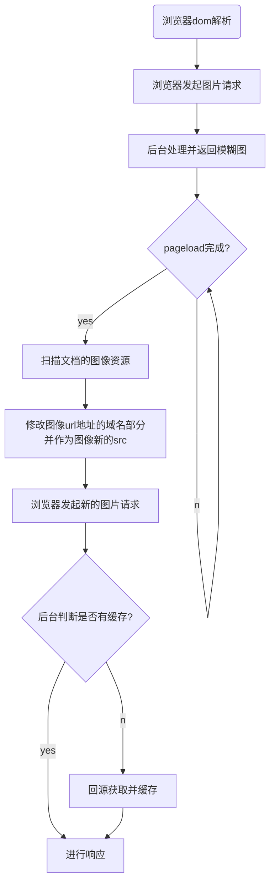
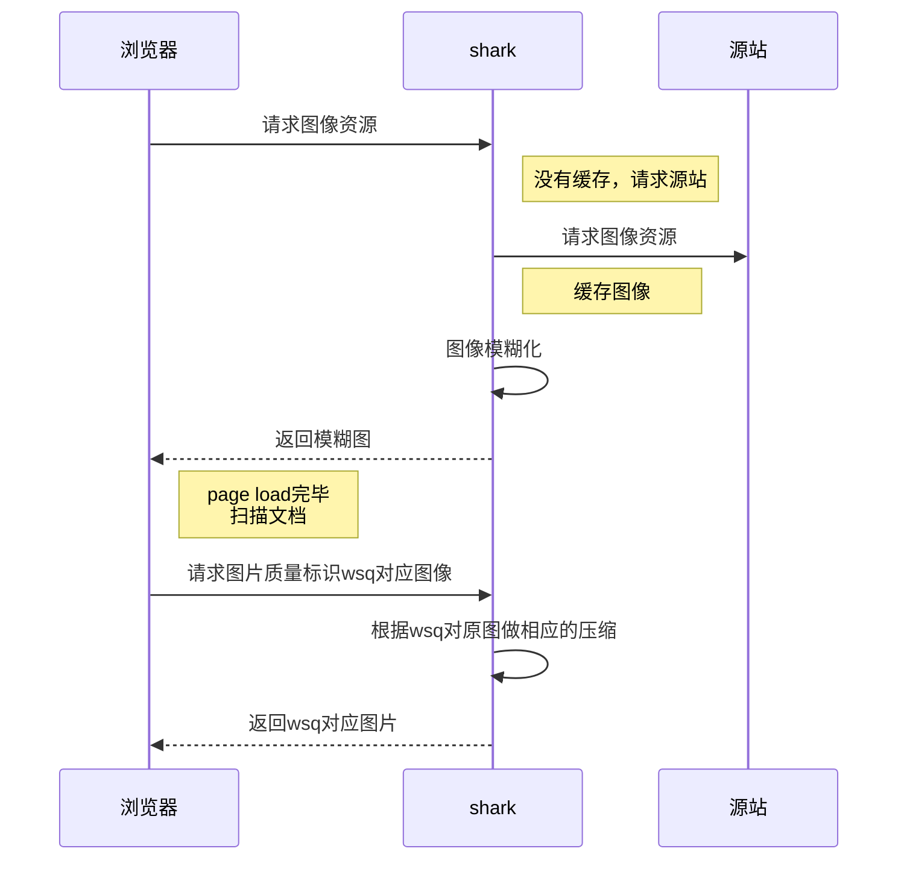
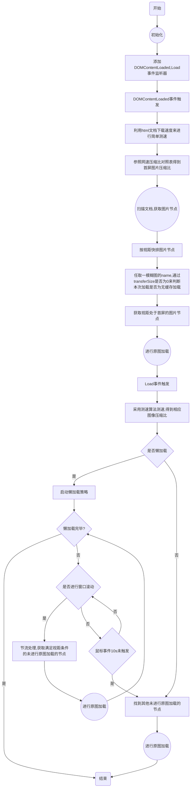
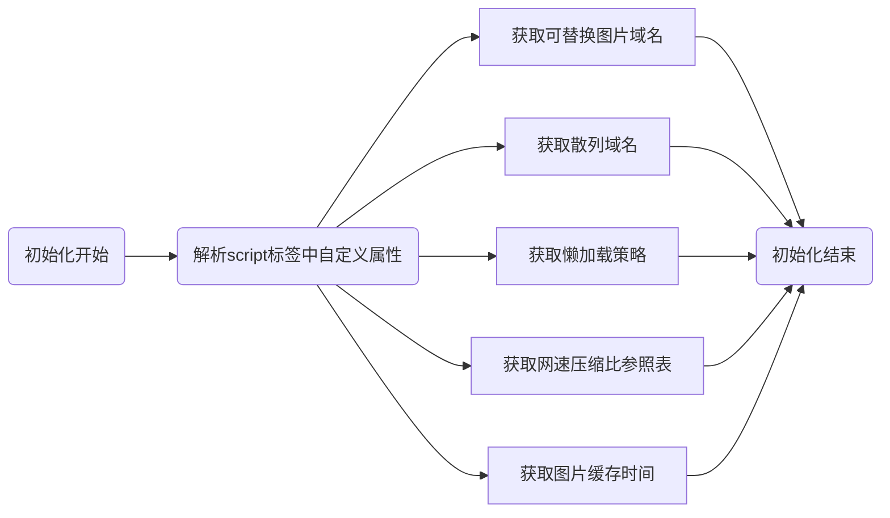
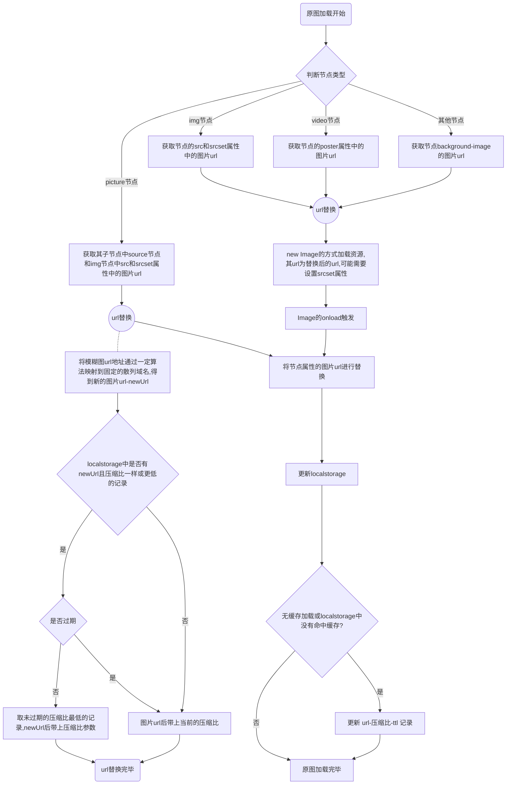
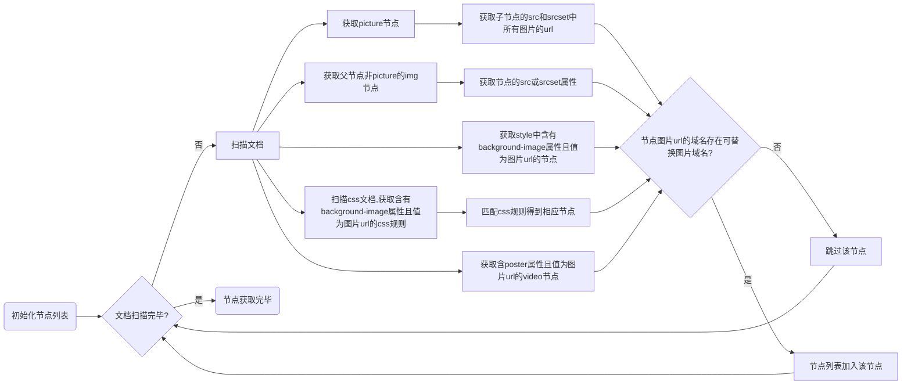

[TOC]
# 一、引言
## 1.1 编写目的
介绍图片分层加载系统架构及技术方案，结合懒加载后的总流程，梳理常见问题及相应解决方案。
## 1.2 项目背景
### 1.2.1 背景
前端优化站的功能模块之一，属于图像优化范畴。
### 1.2.2 业界客户现状
大部分客户在图片加载上没做优化，页面直接加载原图，浏览器会发起大量原图请求，导致页面加载时间过长，网络带宽消耗大。

因此，我们提出了一整套的图片优化解决方案，实现页面图片懒加载，加快客户页面加载速度，节省流量。
### 1.2.3 友商技术方案

Akamai 在图像优化上提出了三个解决方案：

- 自适应压缩
> 基于网络条件分层加载,提供多种压缩级别的图像资源
- 懒加载
> 仅加载当前浏览器视区可见的图像，当用户向下滑动时加载新图像
- 特定图像格式优化
> webp、jpeg2000等图像格式可以降低负载，而不影响图片质量,但只有特定浏览器兼容

**目前本方案能实现以上功能**，并在懒加载方案继续优化，结合了预加载的思想，当pageload后且scroll一定时间没有触发，会触发图像加载机制，用于满足某些客户需求。


## 1.3 术语定义
小图： 分辨率不变，图像质量较低的图片资源-模糊图
小小图： 后台又对小图做了压缩处理

## 1.4 参考资料

<a href="https://www.akamai.com/cn/zh/web-and-mobile-performance.jsp">AKAMAI WEB 性能解决方案</a>

<a href="https://github.com/tuupola/jquery_lazyload/tree/master">lazy_load开源库</a>

# 二、系统架构
*本套系统分为前端和后台，本文侧重于介绍前端部分。*

当浏览器发起html文档请求时，后台会对该文档进行修改并返回。

先介绍下后台的**html文档改写规则**(仅针对图像优化功能):
> 在文档底部插入图片优化的js代码，配置项通过设置script节点的自定义属性来实现。
>
> 主要配置项：散列域名，是否开启懒加载，懒加载策略，是否处理`background-image`

前端这边收到html文档之后，与后台交互流程如下：

## 流程图



## 时序图



~~或者采用另外一个方案，修改html文档中img的src，原图放在data-src中，这样可以控制哪些图片需要做分层，可解决后面提到的 **`根据媒体属性的渲染`** 问题，但是改写文档的工作量和难度都比较大~~

## 前端流程

原图请求通过url替换的方式，不采用ajax

### 总流程

### 初始化具体流程


### 原图加载具体流程

### 扫描文档，获取图片节点具体流程


# 三、常见问题及解决方案

## 3.1 源站有做懒加载策略的

默认情况下，会出现后续请求原图时，后台返回小图的问题。

因为访问的域名没有做更改，后台默认小图处理。

此外，还会发起更多的请求

- img中没有src

pageload后扫描文档并拿不到src 故不会发起获取原图的异步请求

- img中src为源站的小图

初次访问小图，后台会返回一张小小图，pageload之后我们扫描文档会去拿小图，加上懒加载策略触发又请求的图片，我们会发三次请求

**`这个由客户配置，客户自己有做懒加载可以不选择我们的分层加载功能，所以这边我们无需考虑`**

## 3.2 css和style中background-image是否进行处理

**`目前前端这边可以做到扫描文档获取到图片地址,对于伪类css（如 div:hover{background:xxx}）还得做额外处理`**

需要测试下伪类

对于 `background-image:inherit`（使用父节点的bg-image）不做处理

## 3.3 根据媒体属性的渲染

- ``的srcset属性和css的image-set()

- `<picture>` source、img子节点

~~初次返回小图，pageload之后前端这边不知道应该请求哪张图片，不知道有没有办法获取渲染的是哪张图~~
可以通过img节点的currentSrc拿到值。(注：picture的也是去拿img的currentSrc)

但还是有新的问题，这个是响应式的，界面变化又会去拿新的图片地址了

> 故需要做img节点currentSrc值变化监听
> 
> 目前没有找到直接监听currentSrc的方法，但是一般currentSrc的变化都是由窗口大小变化引起的，故需要节流监听下window.resize,判断currentSrc有变化没。

后面发现，即使知道图片地址变化了，也并不能通过img改src的方式替换图片，因为srcset存在的时候src是无效的。

**`故解法只有在pageload的时候，把srcset中图片的地址做替换`**

## 3.4 和懒加载结合的策略

- 加载全部小图，pageload后加载全部大图，不做懒加载

- 加载全部小图，滑动懒加载大图

- 加载首屏小图，滑动懒加载大图

> 目前是加载全部小图和首屏大图
- loaded时开启懒加载，滑动懒加载大图，load前滑动不做处理
- domcontentloaded时开启懒加载，未load前都是加载的原图。

## 3.5 原始图片较小，第二次不做加载

采用ajax请求，根据响应值长度判断，响应值长度小于某个值 说明是错误请求或者不做加载

最后通过 window.URL.createObjectURL() 插入图片。但是该方案不能解决`问题3`

**新方案**：**`第一次发过来若是原图，设置缓存策略，后续请求，返回307重定向到原来地址，这时候本地有缓存就不会再发请求了`**


## 3.6 根据网络速度，在第二次按照一定比例加载高清图

如何测速？

利用`Resource Timing API` ，现代浏览器大部分支持，详见caniuse，

若不支持(safari11以下)，则采用`navigation timing`

该api必须在`page load`后才能使用。

**`具体网络带宽估计算法需要一定策略来评判`**

```js
//计算浏览器加载该文档的时间
var nav = performance.getEntriesByType('navigation')[0]
console.log(nav.responseEnd-nav.responseStart,nav.transferSize,nav.transferSize/(nav.responseEnd-nav.responseStart)+"KB/s")
```

facebook的测速算法：

前面资源还有做一定的过滤和排序（按responseEnd），
```js
performance.getEntriesByType('resource').filter(v=>v.responseEnd-v.responseStart>30).reduce((sum,cur)=>0.5*(cur.transferSize / (cur.responseEnd - cur.responseStart || 1))+0.5*sum,0)
```
facebook带宽利用率：`所有响应时间和及响应间隔和/所有响应时间`

~~我们假设网络速度恒定（不抖动），给出以下数据（响应开始时间，响应结束时间，资源大小）。我们会计算每一段的响应速度，最后取最大值。这样解决了之前只计算html文档存在的问题，并且该方案的结果也兼容了html文档计算。
这边假设了网络不抖动。当出现网络抖动情况，会出现前面下载速度和后面不一致情况，但是由于我们后面也会做计算，在数据量足够的情况下是趋于稳定的。
推荐数据结构：线段树+扫描线 `O(nlogn)`
暴力解法：`O(n²)`~~

### 算法流程
0. 数据结构体
```js
{
  name: v.name,//标识而已
  start: v.responseStart,
  end: v.responseEnd,
  size: v.transferSize,
  //KB/S 新算法中不用该参数
  speed: v.transferSize / (v.responseEnd - v.responseStart || 1)
}
```
1. 过滤、按start值升序排序
> 剔除小数据,保留满足以下条件数据--》小数据会导致出现过大的网速计算结果，剔除小数据后对总体结果影响小，
` v.transferSize > 100 && (v.responseEnd - v.responseStart) > 10 && v.responseStart < loadTime`
2. 分组，将响应时间无连续的分组

3. 计算每组的每条响应的速度（具体计算见如下），并计算整组均值、方差、最大值
 - 3.1 将每条响应的start,end放入numArr
 - 3.2 numArr去重，升序排序
 - 3.3 将每条响应的时间区间按numArr值分割，当其他响应有重复的区间，该条响应的该时间区间会乘以重复的数量(包括自己)
 - 3.4 将每段时间区间相加，形成该响应的实际响应时间，用size处于该时间则为该响应的实际速度
 - 3.5 计算每条响应的速度
4. 根据size做加权平均，得到每组带宽估算值。
5. 比较每组数据的结果，取最大值

目前仍存在问题：小数据短时间，当×上一定并发时，会使数据过大。
> size加权平均，弱化小数据的影响

算法效率过低O(n³)：需要改进
> 目前O(n²)，仍可以剪枝优化

## 3.7 图片合并，第一次是模糊图片，第二次是补充信息，合并后变成原图

较难，目前不研究

## 3.8 存在缓存，还是会分层加载，体验不好

简单的将过程放在domcontentloaded时并不能解决问题，会导致初次加载或者无缓存加载，可能不触发分层机制（模糊的src未下完又直接被替换了）。

**分层加载逻辑修改为**：
1. html的原始文档,img仅做占位
```html
<!-- 初次加载的文档 -->
<figure>
  <noscript>
    
  </noscript>
  
</figure>
```
2. domcontentload后，js将img用div替换，并开始模糊和高清图片的加载
```html
<figure>
  <noscript>
    
  </noscript>
  <span>
    <!--VagurImage中设置了背景色-->
    <div class="VagurImage" data-src="https://pic4.zhimg.com/50/1355440786fffad694ed56130dbbc0bc_hd.jpg" style="width:654px;height:980.51px">
      <!--设置了高斯模糊和透明度-->
      <div class="VagueImage-mask is-active">
        ::before
        ::after
      </div>
    </div>
  </span>
</figure>
```
3. 模糊图片下载完毕,设置background-image
```html
<!-- 文档其他地方不变不变-->
<div class="VagueImage-mask is-active" background-image="url('https://pic4.zhimg.com/50/1355440786fffad694ed56130dbbc0bc_60w.jpg')">
  ::before
  ::after
</div>
```
4. 高清图下载完毕
```html
<figure>
  <noscript>
    
  </noscript>
  
</figure>
```

js代码:

```js
//还是放在domcontentloaded执行
document.addEventListener("DOMContentLoaded",func,false)
//func
//采用两次Image，若img直接加载模糊图的话，只需imgLarge即可
let smallImage = document.getElementById('small-img')
let img = new Image()
img.src=smallImage.src
//由于smallImage的已经load了，这边我们利用缓存再加载同个图，会去拿缓存触发onload
img.onload = function(){
  //下图加载完毕
}
let imgLarge = new Image();
imgLarge.src = smallImage.getAttribute("originSrc")
imgLarge.onload = function(){
  smallImage.src = imgLarge.src
}
```

> 但是目前该做法有个问题，就是原图获取是在domcontentloaded的时候进行，此时还未进行测速，或者说此时进行测速用我们的测速算法是不准的（资源下载过程中`performance.getEntries`是拿不到该资源的）。
> 一个想法是对于未测速时，都加载原图


## 3.9 带网络参数，不会命中原图已有本地缓存 

问题详细描述：本地已缓存原图`a.jpg`，本地通过网络计算需要去请求低清图片`a.jpg?q=50`,这样就浪费了原来的原图缓存了。

解法：不同比例图片load后，将`url-TTL`放到localstorage中。每次网络计算完后，先查询缓存中有没有更高清的且未过期的图片，有的话选更高清的进行请求，不对localstorage做处理 ；否则请求相应网络状态的图片，onload后保存或更新localstorage。

> 注1：每种清晰度图片的TTL可配置，通过script节点自定义属性设置。

> 注2：本地只有低清缓存不考虑请求是因为我们当前网络状态算还行了，不需要用低清的，否则多次清晰度切换会对用户造成视觉上影响。

当前这个问题也可以通过`blur+动画`解决，需要产品评估下。

存在问题：强刷页面或者`disable cache`，请求图片得到响应后，`cache-control`本地缓存时间会重新计算。相应的我们localstorage的TTL也要进行修改

解决方案：这边我们主要就是判断图片是否为无缓存请求，当为无缓存请求，img.onload后需要对localstorage进行更新。
至于怎么判断是否为无缓存，就用`performance.getEntriesByName('当前加载图片的url')`结果是否满足某些规则来判断


## 3.10 原图访问会做url替换，当前不是用h2 而是用域分片，当两次图片请求不是同个域时会不走缓存

> 方法1： 将图片链接与域名做map映射`url->host`，保存在localstorage，下次访问会先查一遍，没有的话就随机访问并保存在localstorage

> 方法2： 利用算法将图片url映射到某个MOD值(length为散列域名列表大小) 需要保证每个计算结果值不变且映射每个域名的概率一致
> js 名称的每个字符的ascii码值相加再mod length

## 3.11 JavaScript被禁用 分层加载拿不到原图

目前不考虑

## 3.12 透明遮罩，动画让图片切换变得自然

```css
.VagueImage-mask {
    z-index: 1;
    opacity: 0;
    background-size: cover;
    background-position: 50%;
    background-repeat: no-repeat;
    transition: opacity .3s ease-in
}
```
不过 由于我们不是提供的小分辨率图再放大，而是提供同分辨率的模糊图，这边就不进行透明遮罩处理了。

## 3.13 图片节点扫描完毕后，后续通过js动态增加的Image节点，若图片src满足分层规则，后台会返回模糊图片

1. 定时扫描
无任何优化时，jd 3k多节点  每次扫描耗时20ms左右，后面可能可以做增量优化。
但有个问题就是需要一直去做定时扫描，对客户网页性能有影响

技术难度低

2. 元素监听

### 通过`Object.defineProperty`去监听src的set

```js
try {
    Object.defineProperty(HTMLImageElement.prototype, 'src', {
      enumerable: false,
      configurable: true,
      get: function () {
        return this.getAttribute('src')
      },
      set: function (newval) {
        //属于可替换域的
        if (newval.indexOf("data:image") === -1 && Util.inlist(newval, settings.imgHostList)) {
          this.setAttribute('src', Util.getNewUrlFromCache(newval, MAX_QUALITY).url);
        } else {
          this.setAttribute('src', newval);
        }

      }
    });
    //TODO srcset的defineProperty
  } catch (error) {
    console.error('Image Element set error', error)
  }
```
兼容IE8，IE8支持对html元素对象进行 defineProperty ,enumerable 需要设置为false

### document.write方法重载

注：要么必须支持js异步加载让document.write延后执行，要么把图片优化脚本放在head中

以下步骤仅测试图片优化功能用，暂不兼容js异步加载功能，document.write方法也是等图片优化脚本加载完毕后执行

1. 获得当前执行脚本节点-currentScript
> 作为标志位，内容将插入在该节点之前，此处命中为节点 CUR
2. 找到CUR的父节点CURP,创建一个CURP.tagName的节点CURC，其innerHTML为所插入内容
3. 遍历节点，找到满足条件的图片节点并进行host替换
4. 将CURC的所有子节点insertBefore(CUR)

该做法获取不到css渲染

技术难度较高

## 3.14 图片节点寻找完毕后，需要进行一个视距排序，这样当没开启懒加载时才会优先加载首屏图像

有空写

# 四、详细设计

## 4.1 获取script自定义数据
```html
<script data-host="xxx" id="speed">
  let ele = document.currentScript
  console.log(ele.attributes["data-host"].nodeValue)
</script>
```
这样可以获取到本script节点的自定义数据

## 4.2 注册window.load事件监听器

```js
function addLoadEvent(func) {
  if (window.addEventListener) {
    window.addEventListener("load", func, false)
  } else {
    //低版ie兼容
    if (window.attachEvent) {
      window.attachEvent("onload", func)
    }
  }
}
addLoadEvent(streamFunc);
```
## 4.3 计算用户网络状况

```js
//计算浏览器加载该文档的时间
var nav = performance.getEntriesByType('navigation')[0]
console.log(nav.responseEnd-nav.responseStart,nav.transferSize,nav.transferSize/(nav.responseEnd-nav.responseStart)+"KB/s")
```

## 4.4 节点获取

### 4.4.1 获取img元素
```js
let imgDOMList = document.getElementsByTagName("img");
[...imgDOMList].forEach((dom) => {
    //其他处理
    //含srcset属性做额外标识
})
```
### 4.4.2 获取style中的background
```js
let styleDOMList = document.querySelectorAll("[style*=background]");
[...styleDOMList].filter(v=>v.nodeType == 1 && v.style.backgroundImage).forEach((dom) => {
    //其他处理
})
```
### 4.4.3 获取css中的background
```js
//获取css中的background，
document.styleSheets.filter(v=>{
  //根据v.href过滤第三方css
  return 
}).forEach(v=>{
  let rules = v.cssRules || v.rules
  rules.forEach(v=>{
    let sel = v.selectorText
    let domList = document.querySelectorAll(sel);
    if(v.style.backgroundImage){
      //满足条件的操作
    }
  })
})
```
完整版本
```js
queryImgNodeList: function () {
      var list = []
        //获取picture节点
        ; (function () {
          var pictureList = document.getElementsByTagName("picture");
          for (var i = 0; i < pictureList.length; i++) {
            //仅img子节点存在时进行下一步判断，一般都会有img子节点
            if (pictureList[i].getElementsByTagName("img").length) {
              var urlList = []
              var nodeList = pictureList[i].querySelectorAll("source,img")
              for (var j = 0; j < nodeList.length; j++) {
                var srcset = nodeList[j].getAttribute("srcset")
                var src = nodeList[j].getAttribute("src")
                if (srcset) {
                  urlList = urlList.concat(getUrlListInSrcset(srcset))
                } else if (src && src.indexOf("data:image") === -1) {
                  urlList.push(src)
                }
              }
              if (urlList.length > 0 && inlist(urlList, settings.imgHostList)) {
                list.push(new WsNode('picture', pictureList[i]))
              }
            }
          }
        })()
        // 获取video节点
        ; (function () {
          var videoList = document.getElementsByTagName("video");
          for (var i = 0; i < videoList.length; i++) {
            var poster = videoList[i].getAttribute("poster")
            if (poster && poster.indexOf("data:image") === -1 && inlist(poster, settings.imgHostList)) {
              list.push(new WsNode('video', videoList[i]))
            }
          }
        })()
        // 获取img节点
        ; (function () {
          var imgList = document.getElementsByTagName("img");
          for (var i = 0; i < imgList.length; i++) {
            if (imgList[i].parentNode.nodeName !== "PICTURE") {
              var urlList = []
              var srcset = imgList[i].getAttribute("srcset")
              var src = imgList[i].getAttribute("src")
              if (srcset) {
                urlList = getUrlListInSrcset(srcset)
              } else if (src && src.indexOf("data:image") === -1) {
                urlList.push(src)
              }
              if (urlList.length > 0 && inlist(urlList, settings.imgHostList)) {
                list.push(new WsNode('img', imgList[i]))
              }

            }
          }
        })()
        /*
        //获取style*background-image
        ; (function () {
          var styleList = document.querySelectorAll("[style]");
          //ie8 not support [style*=background]
          for (var i = 0; i < styleList.length; i++) {
            var cur = styleList[i];
            if (cur.nodeType == 1 && cur.style.backgroundImage) {
              var url = getBackgroundImageUrl(cur.style.backgroundImage);
              if (url && inlist(url, settings.imgHostList)) {
                list.push(new WsNode('style', cur))
              }
            }
          }
        })()
        //获取css background-image
        ; (function () {
          for (var i = 0; i < document.styleSheets.length; i++) {
            var href = document.styleSheets[i].href;
            //过滤不满足规则的css外链
            if (href && !inlist(href, settings.cssHostList)) {
              continue
            }
            var rules = document.styleSheets[i].cssRules || document.styleSheets[i].rules
            //遍历每条规则
            for (var j = 0; j < rules.length; j++) {
              var url = getBackgroundImageUrl(rules[j].style.backgroundImage)
              if (url && inlist(url, settings.imgHostList)) {
                var eles = document.querySelectorAll(rules[j].selectorText)
                for (var k = 0; k < eles.length; k++) {
                  list.push(new WsNode('css', eles[k], url))
                }
              }
            }
          }
        })()*/
        //获取background-image的节点
        ; (function () {
          var bglist = document.querySelectorAll("*")
          for (var i = 0; i < bglist.length; i++) {
            if (bglist[i].nodeType === 1) {
              var url = getBackgroundImageUrl(getStyleBackgroundImage(bglist[i]))
              if (url && inlist(url, settings.imgHostList)) {
                list.push(new WsNode('bg', bglist[i], url))
              }
            }
          }
        })()
      return list
    },
```
### 4.4.4 获取picture节点
```js
let imgDOMList = document.getElementsByTagName("picture");
imgDOMList.forEach(v=>v.childList.forEach(c=>c))
```

为避免重复计算，先扫描`picture`,再扫描`img`

## 4.5 懒加载

### 方法1 IntersectionObserver
兼容性差，开发量低

### 方法2 scroll+window.requestAnimationFrame()
兼容性高，开发量还行

## 4.6 图片地址替换
```js
// 判断是否为可替换域名
function judgeHost(url){

}
// 相对路径转绝对路径(IE6, IE7)无效
function directlink(url){
  var a = document.createElement('a');
  a.href = url;
  return a.href;
};
// 根据散列域名、网速替换url
function replace(originUrl,hashHost,networkSpeed){

}
```