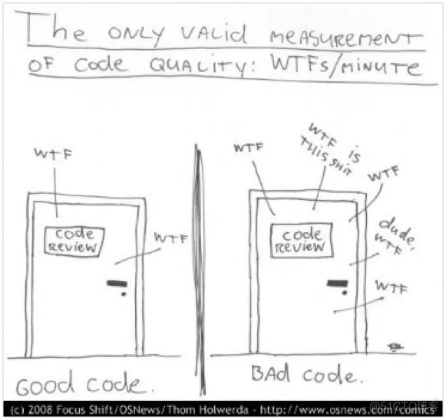
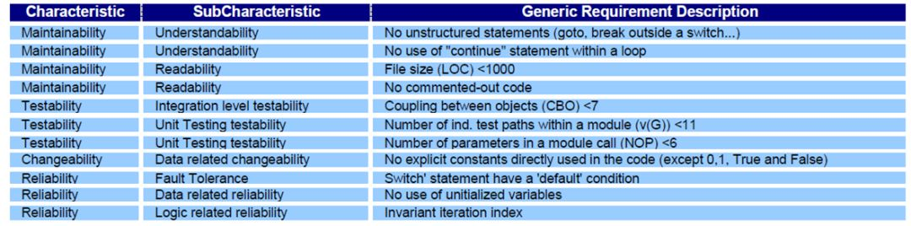
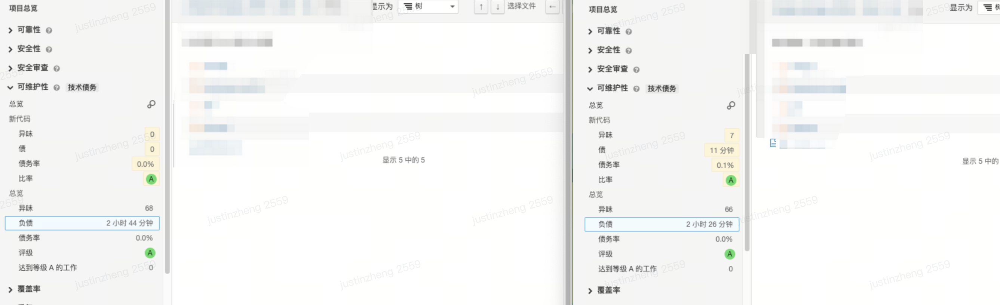
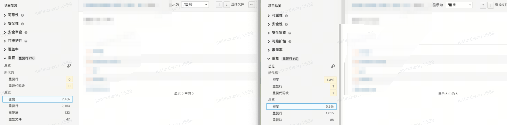
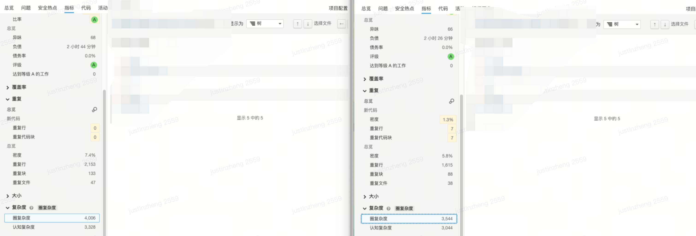

在软件开发领域，代码质量一直是开发者们关注的焦点之一。为了更好地评估和管理代码质量，人们逐渐引入了量化指标的概念。

本文将从**代码质量的定义、定性方法、量化指标**等方面展开讨论。

<!-- more -->

# 代码质量：好代码与坏代码
什么样的代码是好代码？

---
TA 说：功能丰富，没有 Bug，性能优越

```js
/*
计算总价：不同的阶梯数量单价不同
*/
function getPrice(num) {
  if(num <= 0) {
    return 0
  }
  if(num <= 10) {
    return num * 10
  }
  if(num <= 100) {
    return 10 * 10 + (num - 10) * 5
  }
  if(num <= 1000) {
    return 10 * 10 + 90 * 5 + (num - 100) * 2
  }
  return 10 * 10 + 90 * 5 + 900 * 2 + (num - 1000) * 1
}
```

> 这段代码从功能完备性的角度来说，能够满足用户的需求，且没有 bug。但我们能说它是好代码么？

---

TA 说：好的代码就像好的笑话一样，它不需要解释（Good code is like a good joke: It needs no explanation）
> 有些代码你就是觉得它好，但是又说不出来好在哪里，这种主观评价其实是因为你没有彻底搞懂它，就像某些中医一样。

---

TA 说：我们可以根据这段代码被骂 shit 的次数来评判


> 这是一个有趣的指标，以 Code Review 时「每分钟爆粗数量」来作为度量指标。但是它不够科学有效，也无法准确度量。

---


至此，我们可以达成 2 个共识：
1. 代码质量指的是实现功能需求时代码内部结构的质量，而不是使用软件或服务的用户满意程度。
2. 好的代码容易维护，而坏的代码会增加理解成本、改动成本等维护成本。


# 定性方法：可维护性
好的代码容易维护，那么容易维护具体是怎样的表现？
参考《重构：改善即有代码的设计》一书中罗列的代码坏味道（比喻低质量的代码设计和实现所显现的“症状”）和重构手法，我们可以对可维护性继续拆解为：可读性、可复用性、可测试性、可变更性。
- 可读性：遵守规范，良好的命名和结构，适当的文档和注释等等。不规范的代码、不良注释和复杂度过高的代码会增加阅读和理解代码的难度
- 可复用性：代码应该尽可能地模块化，降低各模块之间的耦合度，提高代码的复用性，避免重复劳动和冗余代码。重复代码会造成维护成本的成倍增加。
- 可测试性：代码应该配备充分的单元测试，覆盖各种边界情况和异常情况，保证代码的稳定性和可靠性。复杂度过高会增加测试覆盖的难度，而缺少测试覆盖的代码会使得定位问题和修复问题的难度加大。
- 可变更性：代码应该具备良好的可扩展性，能够方便地进行功能扩展和修改。结构不良、低内聚高耦合的代码则会使得哪怕是微小的需求变更或功能扩展都无从下手，修改的代价很可能超过了重写的代价。

至此，我们得到了一些定性的办法来衡量代码的质量，可以参考书中的重构方法来应对这些问题。

# 量化指标：SQALE 与技术债
借助扫描工具，我们可以得到一些技术指标。

| **指标** | **说明** |
| --- |  --- |
| 可靠性 | 这个区域对应的代码，会遇到更多期望外的问题。> 部分是误报(插件能力或配置问题)> 部分确实能够发现，参考示例 |
| 覆盖率 | 代码覆盖测试过的次数> 需要搭配额外的测试覆盖率工具使用。 |
| 重复率 | 代码重复的比例 |
| 文件行数 | 代码行数、注释数等 |
| 复杂度 | 圈复杂度，表示测试当前代码，所需要编写的单元测试的最小数量 |

以上这些指标偏向于过程指标，我们还是难以回答某段代码的质量具体如何，两段代码哪个更好等等这类的问题。

因为我们仍然没有完全解决代码质量的**量化问题**：
-   同样都是代码质量问题，重复代码和过多注释的危害肯定是不一样的
-   同样都是代码重复问题，行重复、块重复甚至整个文件内容重复的危害程度也不一样

所以我们不能直接用问题的数量来衡量质量，需要找到更精细合理的量化度量方法。
我们希望的是：**继续维护这段代码，需要消耗多少人力。对代码进行重构后，后面可以节省多少人力。**

那么就需要做两件事：**一是细拆度量规则；二是统一度量单位。**

目前业界的代码质量度量标准为 [SQALE](http://www.sqale.org)(Software Quality Assessment based on Lifecycle Expectations)


> 特征分类 > 特征子类 > 度量规则
1.  从左向右按照不同维度将代码质量分解为最小单元，可直接度量
2.  第一列为一级维度，包括：**可维护性、可测试性、可变更性、可靠性**等特征分类
3.  第二列为二级维度，比如可维护性又包括了**可读性**和**易理解性**等特征子类
4.  第三列为具体的度量规则，对应着具体的代码扫描规则，比如`文件行数 < 1000`等

得到度量规则后，**如何评估某个分类甚至整体的一个质量度量值**？肯定不能直接按问题次数相加，这样的话就回到了最初的问题，而且注释过多和重复代码的影响层面也不一样。

SQALE 给出的解决方案是引入「债务」概念， **债务的本金为修复代码质量问题所需消耗人力资源估值（债务时长）。** 每条质量扫描规则都对应着一个债务计算方法，有的规则是设定了固定的债务值，有的则根据违规程度有相应的计算公式。

> 比如修复一个圈复杂度为15的方法需要一个开发人员15分钟的时间（以 sonar java 分析器默认设置为例）

**至此，SQALE 方法就可以把不同规则对应的代码质量度量统一人力资源的消耗这一单一指标上。**
现在，如何客观评价代码的质量，已经得到了解答。

---

还有另一个问题，如何比较这两个项目的质量？现在有了**债务时长**这个绝对值，但是不同规模，不同类型的代码如何比较呢？
那么就需要引入一个 **「负债率」** 的概念。
负债率 = `偿还债务所需耗费的资源 / 重写所有代码的预估耗费的资源`
对于分母的计算，目前扫描工具大多是按`代码量 * 开发生产力水平`计算得出，其中开发生产力水平为 **系统配置项** ，表示`编写一行代码的平均估计耗时`（大概估值，并不准确）

有了这个负债率之后，我们就可以**大致估算**出当前项目的负债情况。负债率越高，表示代码迭代难度越高，当负债率超过 100%（资不抵债），那么重写项目往往比继续屎山迭代更好。

# 业务实践：基于 sonarqube 的指标分析

笔者近期在重构某个项目的状态管理设计，需要分析重构后的数据和收益。
借助 sonarqube ，收集了如下数据：
- 负债时长降低 10% （2.7 小时 -> 2.5 小时）

- 代码重复率减少 1.6 %（7.4% -> 5.8%）

- 圈复杂度降低 12% （4006 -> 3544）



# 最后聊聊：代码质量高，那又如何
社区有一些相关的论调，大家怎么看？


# 扩展阅读
-   [代码质量与技术债](https://cloud.tencent.com/developer/article/1151495)
> 本文原文在[飞书](https://itoutiao.feishu.cn/docx/PCHQdOKdFoi2Uix1VW0cWmRwnBe)