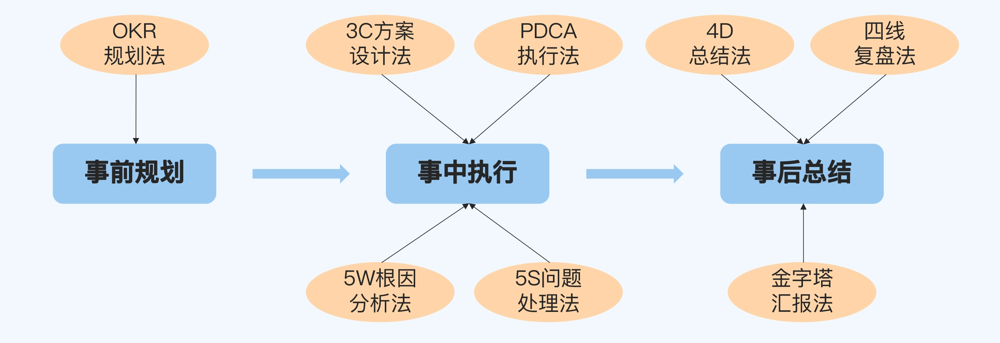
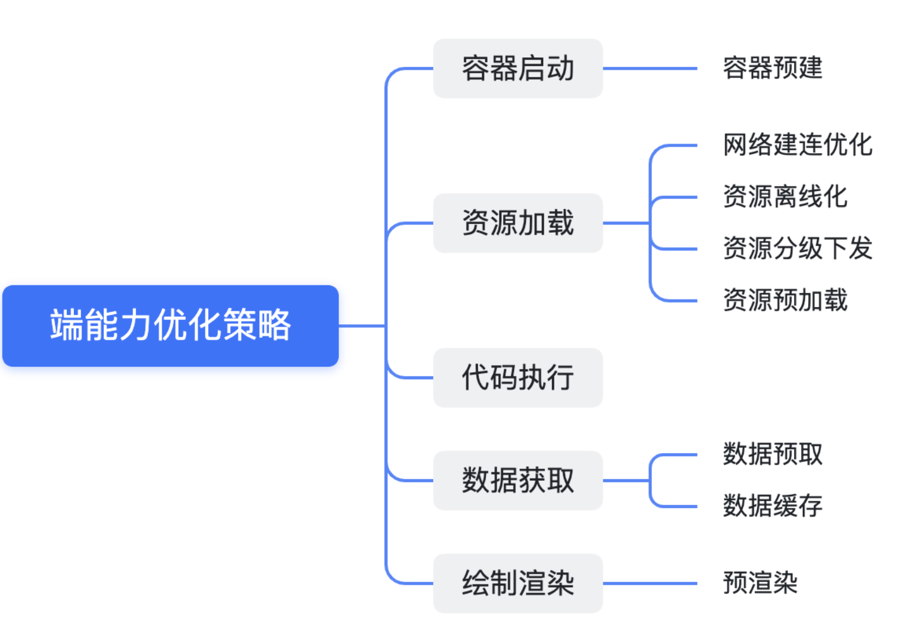
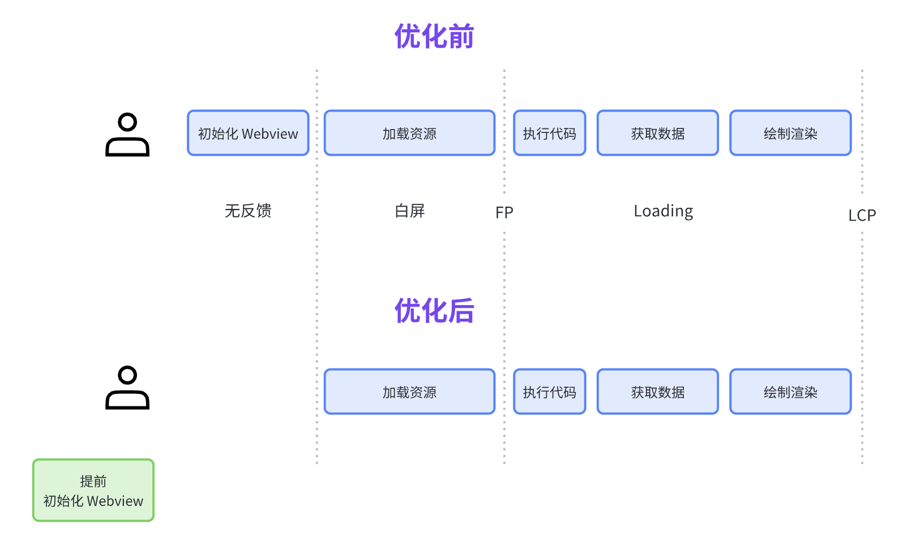
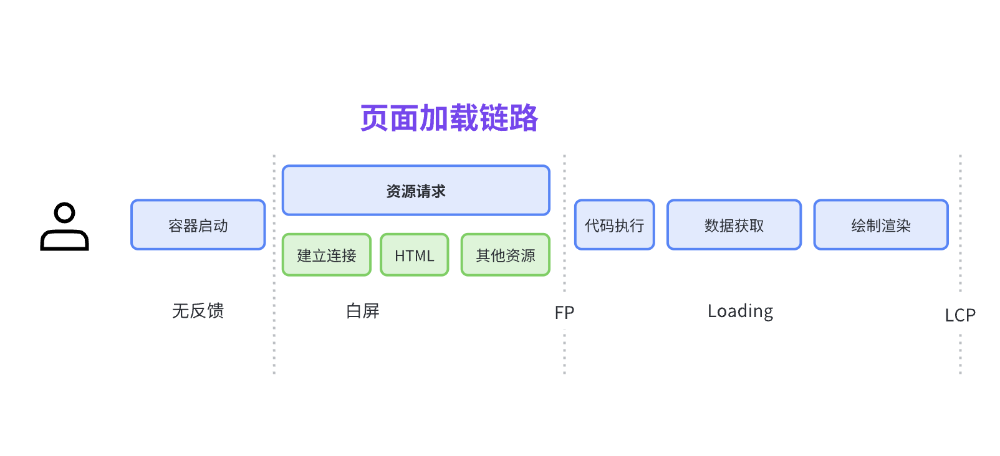
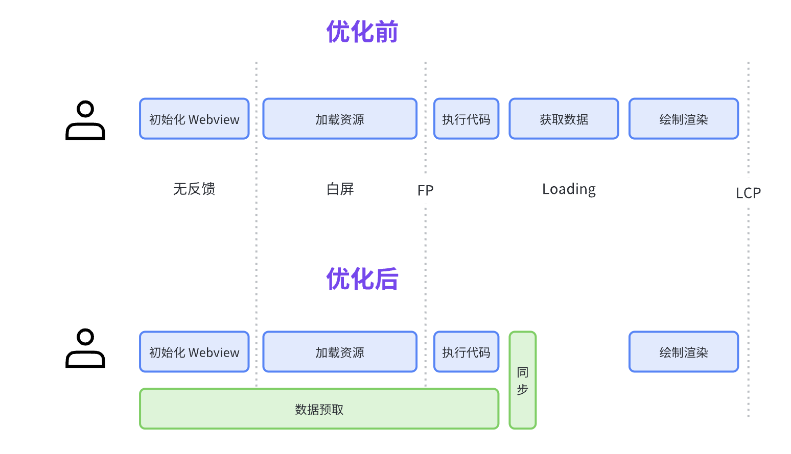
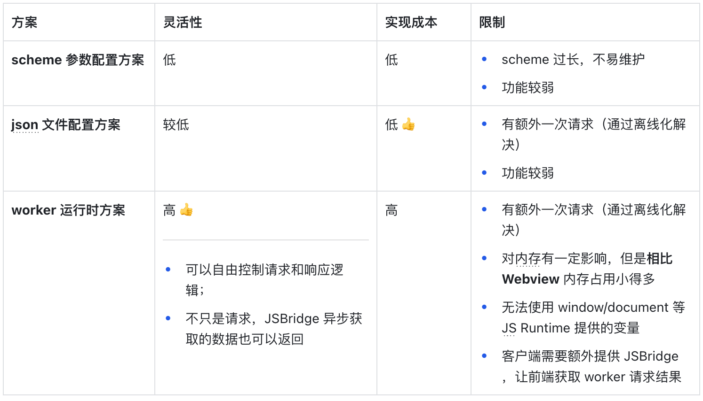
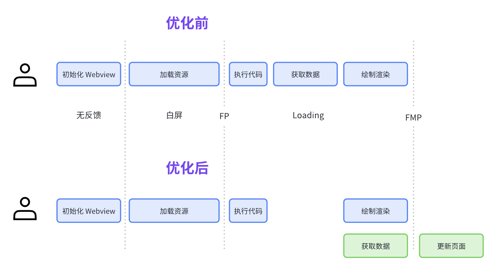
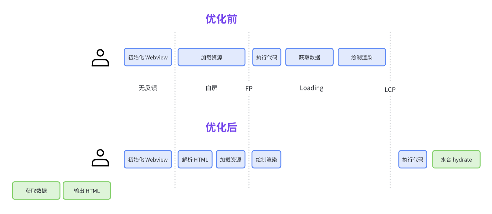
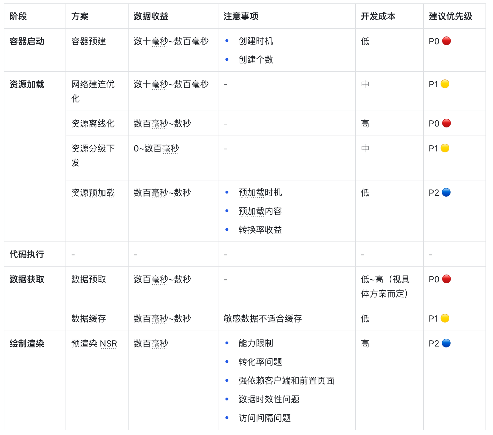
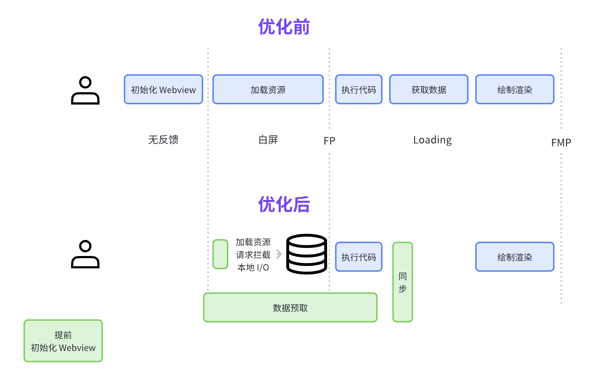

之前写了一篇文章 《[如何实现 H5 秒开？](https://juejin.cn/post/7249665163242307640)》 ，聊到了如何根据**分类思维**来梳理性能优化方案，反响还不错。


于是，我计划输出[「前端首屏优化」专栏系列](https://juejin.cn/column/7266984374846259239)，从不同角度聊聊首屏优化实践，包括且不限于防劣化、工程体系、端能力等，欢迎关注 ✨✨。

  


作为专栏的第一篇，本文将从客户端角度，聊聊如何借助**端能力**优化前端首屏加载速度。除了方案介绍，本文还会提供数据收益、注意事项、开发成本等，以帮助大家更好的评估实现优先级，选择适合业务的方案。

  
<!-- more -->

# 本文适合哪些读者

本文主要是经验和原理之谈，不涉及客户端代码实现，比较适合想开拓视野的**前端领域读者**。

# 整体方案



上图为通用的**页面加载链路，** 利用分类思维，对该流程进行**简化、前置、拆分**，得到如下客户端优化方案：




以上是 8 种常见的优化手段，实际项目中不一定都用上，并且优化手段也不止这些。

  


下面，我将进一步介绍这些方案。

# 一、容器启动

与浏览器不同，App 打开 H5 页面的第一步并不是建立页面请求连接，而是**初始化 Webview**。

初始化 Webview 包括创建 Webview 实例，对于 App 冷启后的首次 Webview 初始化，还需要初始化浏览器内核。

  


因此，对于冷启或者全新安装的 App ，首次初始化 Webview 耗时相对较长，大概在**数百** **ms** ；而二次打开就较快了，大概在**数十 ms**。

  


| 首次打开 Webview 耗时 | 二次打开 Webview 耗时 |
| --------------- | --------------- |
| 数百ms            | 数十ms            |

> PS：具体数据与用户设备有关，经验值大致如上

  


容器启动优化的目标就是**将初始化的这段时间省去**，常用的解决方案是**容器预建**。

## 1️⃣ 容器预建

提前创建 Webview 容器，当需要加载页面的时候就可以直接使用，省去容器初始化时间（数十ms~数百ms）。



  


提前创建 Webview 容器，需要注意**创建时机**和**创建个数**。

-   创建时机：闲时创建。Webview 只能在主线程创建，但又不能阻碍主流程，因此需要在 IdleHandler 时机处理。与前端的 requestIdleCallback 、React Scheduler 概念相似。
-   创建个数：一般仅创建一个，当预创建的 Webview 容器被使用后，再重新预创建（考虑内存状态）。

  


此外，结合线程池的概念，可以对容器进行**复用**，页面销毁并不回收 Webview 容器，而是继续常驻（考虑内存状态）。

# 二、资源加载

容器启动后，客户端将发起页面请求并加载资源。



根据页面的复杂度，这一阶段耗时大概在几十毫秒到数秒之间。

常用的优化手段包括：

1.  网络建连优化：优化网络连接，让解析更快、链路更短
2.  资源离线化：使用本地资源，直接省去网络请求
3.  资源分级下发：根据机型信息差异化分发离线包，减少包体积
4.  资源预加载：在当前页面空闲状态加载下一页面资源

## 2️⃣ 网络建连优化

利用 DNS 预解析以及 DNS 缓存，让请求解析更快。

利用 CDN、域名智能调度等方案，自动选择链路较短的服务。

根据经验，这块的优化能够节省数十 ms 到数百 ms 不等。

  


另外，网络建连优化并不单针对 H5 处理，而是对整个客户端请求都有收益，但需要有相应的基建配合。

## 3️⃣ 资源离线化

资源离线化，即将 H5 资源提前下载（或内置）到 App 中。这样加载资源时就可以通过 App 内部的请求拦截机制转发本地资源，避免网络请求。

  


优化后，可以显著降低 **「资源加载」** 这个环节的耗时，减少白屏时间，一般不超过 100ms（仅剩资源解析和本地 I/O 耗时），不再受弱网限制。

  


不过，要实施一整套完整的离线化方案，需要考虑的点较多：

-   **更新策略：** 紧急更新、轮询更新、冷启更新
-   **动态差分：** bsdiff 算法，获取不同版本离线包的差异
-   **签名校验：** 校验资源是否被篡改
-   **在线** **CDN**：离线资源未找到的情况下使用 CDN 资源兜底
-   ...

网上找了一个[开源方案](https://github.com/mcuking/blog/issues/63)，可供学习使用。

  


此外，还需注意 「HTML 是否应该放入离线包」的问题，是选择更好的性能还是更好的更新速度。

> 关于这方面的考量以及优化策略，我写了一篇 [HTML 放入离线包?你需要了解的离线策略 - 掘金](https://juejin.cn/post/7254549436625256506)，推荐阅读

  


## 4️⃣ 资源分级下发

分级下发指的是根据用户设备信息（机型、系统等）下发不同的资源包，尽可能减少资源请求大小。即可以作用于离线包，也可以作用于在线 CDN（边缘计算）。根据业务经验，**每减小 100 KB 体积，约带来 50 ms 的收益。**

  


要实现资源分级下发，往往还需要**前端打包配合改造**。

举个例子：

-   **静态资源分级**：相对低端的机型，内存以及分辨率并不高，那么页面中的图片就没有必要使用三倍图了。在前端打包的时候，对图片进行不同等级的分级压缩（参考 [sharp](https://github.com/lovell/sharp) 工具），得到多种版本产物。
-   **业务代码分级**：除了资源外，还有一种极致优化，如果业务针对操作系统做了较多的适配代码，那么可以在打包的时候，编写打包插件，抽分得到两份不含系统兼容逻辑的产物。

  


根据系统版本获取相应系统的资源，这个好理解。但是机型这个怎么评估中高低端？

其实也很简单，**建立机型库，维护机型评分**。不同业务可以根据评分、系统版本等设定自己的中高低端机型范围。

> 针对某些机型的特殊情况，还可以建立一套白名单和黑名单机制。

这样，在客户端发起离线包资源请求的时候，带上机型信息，离线包平台/ CDN 服务就可以计算得到合适的资源包了。

  


需要注意的是，随着网络速度逐渐变快，该方案的性能收益越来越小。

但除了性能收益外，分级下发还有两个优势：

-   **节省带宽**：离线包下发用到的带宽也是要钱的
-   **优化** **内存**：中低端机使用较小的图片，可以避免内存溢出。

  


## 5️⃣ 资源预加载

资源预加载指的是，在当前页面提前缓存下一个页面的资源。

在浏览器上，我们可以使用 [Prefetch](https://developer.mozilla.org/zh-CN/docs/Glossary/Prefetch) 实现这个效果，浏览器会在[空闲时间](https://developer.mozilla.org/zh-CN/docs/Glossary/Prefetch#%E6%B5%8F%E8%A7%88%E5%99%A8%E7%9A%84%E7%A9%BA%E9%97%B2%E6%97%B6%E9%97%B4%E6%98%AF%E5%A6%82%E4%BD%95%E7%A1%AE%E5%AE%9A%E7%9A%84%EF%BC%9F)下载指定的资源。

```html
<link rel="prefetch" href="/images/big.jpeg" />
```

该方案针对多页面有效。但在移动端上，我们通常不会选择 MPA （多页面），而是打开多个 Webview ，或者原生和 Webview 互相跳转。

因此，**要想实现资源预加载，就得借助客户端能力：** 在上一个页面（原生或者 Webview）调用 JSB ，传递需要预加载的资源地址，由客户端内部进行请求和缓存。

在实现细节上，还要做到请求复用。即在资源请求过程中，若发生页面跳转，则继续未完成的目标请求而不是重新创建。

> 你看，这像不像一道面试题 —— 「使用 Promise 实现请求复用」

  


此外，要实施**资源** **预加载**还需要关注 3 个事：

-   预加载时机：需要在空闲状态进行，避免和主逻辑竞争资源。
-   预加载内容：一般由服务端下发，涉及三端配合（移动端、前端、服务端）。
-   转换率收益：预加载会带来更高的资源带宽成本。如果前置页面到目标页面转化率只有 10%，那么请求数量会放大 10 倍，造成带宽成本浪费。

基于以上原因，资源预加载的使用场景往往有限，不是所有页面都适用。

  


# 三、代码执行

相比原生页面的提前编译/静态编译（AOT），JS 的动态编译（JIT）性能相对较差。在低端机上，这个差异更为明显。

因此，若要优化代码执行效率，有一个解决方案是 JS 代码 AOT 化。**个人水平有限**，不敢多说，提供两篇文章供拓展学习：

-   [TypeScript/JavaScript低成本静态编译AOT的探索](https://zhuanlan.zhihu.com/p/572447953)
-   [V8 JS AOT化的探索与实践](https://developer.aliyun.com/article/883407)

  


此外，由于业务的动态性，不可能所有 JS 代码都走静态编译。

一个思路是，采用原生渲染或自绘制，首屏代码走 AOT，基于原生能力执行；后续业务逻辑代码走 JIT ，基于 JS Runtime 执行；两者通过 JSBridge 通信。

  


要完成这套工作，需要开发构建工具、渲染引擎等一系列套件，事实上已经脱离纯前端生态，因此，我并不打算将其列为前端首屏优化手段。

  


各大厂应该也有类似的框架，比如字节的 Lynx ，这里有一篇介绍文章：[Lynx：来自字节跳动的高性能跨端框架](https://cloud.tencent.com/developer/article/1916784)。从个人使用经验上看，对首屏性能提升确实蛮大的，结合其他优化方案基本能做到**首屏直出**，与原生无异。

  


# 四、数据获取

前面环节执行完毕，此时已经得到一个骨架页面，待数据填充。

接下来就是数据获取部分，页面数据通过主接口获取，耗时在**数百毫秒到数秒**不等，和数据量、网络、服务链路有关。

要对这个环节进行优化，通常有两种手段：

-   数据预取：提前获取
-   数据缓存：优先使用旧数据


## 6️⃣ 数据预取

数据预取指的是将数据获取时机前置，通常是与 Webview 初始化并行，并由客户端发起数据请求。



优化后，原来的数据获取阶段不再额外发起请求，而是复用客户端请求结果。如果请求还未拿到结果，则继续等待。

> 实际上前端无需额外处理，正常前端发起的请求也是走的 JSBridge ，统一由客户端在内部处理即可。


那客户端如何知晓请求参数？业界常用方案有以下三种：

-   scheme 参数配置：将数据请求信息编码后放到 webview scheme **指定参数**中
-   json 文件配置：数据请求信息采用 JSON 维护，文件地址可以基于 scheme 参数配置，也可以约定固定地址，比如 `https://页面路径/prefetch.json`
-   worker 运行时方案：前端编写 JS 函数并单独打包文件，客户端额外启动轻量级 JS 引擎（比如 [tabris](https://github.com/eclipsesource/tabris-js)(j2v8)、[quickjs](https://github.com/taoweiji/quickjs-android)）运行该文件。文件地址可以基于配置也可以基于约定。

方案对比如下：




> PS：大多数情况下，使用 json 方案即可，成本低，收益高

  


## 7️⃣ 数据缓存

这个应该很好理解，将页面数据存入缓存；下次进入页面，优先使用缓存数据，同时发起请求以待后续页面更新。



  


需要注意的是，不是所有数据都适合缓存。

  


对于敏感数据、可能对用户造成较大误解的，不建议缓存，比如积分、金币、红包、金额等与钱有关的数据。

其他相对次要的数据，可以使用缓存，比如收藏记录、粉丝数数据等。

> 是否缓存依业务而定，没有严格的划分标准。

  


此外，数据缓存还应该**设定缓存时效**，避免数据差异过大。建议缓存一小时，具体可以根据业务决定。

# 五、绘制渲染

获取到数据后，最后一步就是绘制渲染了，对应的是 [LCP](https://web.dev/lcp/) 这个数据指标。

> 严格来说，前面的资源加载和代码执行阶段也有页面渲染行为，但更多以页面骨架展现为主，对应 FP、FCP、FMP 等数据指标。

  


要对这个阶段进行优化，业界常见的方案是预渲染，即在上一个页面的空闲状态，提前渲染页面。

关于预渲染的实现，主要分为两种：

-   Webview 完全预渲染：额外启动 Webview 容器并完整地加载页面。对性能影响较大，较少使用。
-   NSR（Native Side Render）：利用客户端原生做 SSR。核心思路是利用客户端启动一个 JS 引擎，执行数据请求 + HTML 文档输出，并将结果缓存。在后续的页面加载过程中，直接渲染 HTML 文档，并做 hydrate （水合）处理。

  


NSR 方案相比 Webview 预加载方案更轻量，对系统内存影响较小。本节着重讲第二种 -- NSR。

## 8️⃣ 预渲染 NSR

> GMTC 2019 全球大前端技术上 UC 团队提到了该方案，详见 [0.3s完成渲染！UC信息流正文“闪开”优化实践_GMTC_庞锦贵_InfoQ精选文章](https://www.infoq.cn/article/9ukos4xh_6wl4fh1fogl)

  


在上一个页面的空闲状态，客户端进行 NSR 处理，提前请求数据、输出 HTML 文档并缓存。



后续加载页面，直接渲染内存中的 HTML 文档，并做 hydrate （水合）处理。

  


使用该方案后，平均能够提升**数百ms**，对 FCP 数据指标的收益较大。同时相比 SSR 方案，对服务端的压力较小。

然而，要实施 NSR 还需关注这 5 个问题：

-   能力限制：由于跑在 JS 引擎上，会缺失 window/document 等运行时变量，因此需要做 mock 处理，同 SSR。此外，还需关注外部 npm 包的表现，避免直出报错导致白屏。
-   转化率问题：预渲染需要在前置页面执行，会带来更高的服务端接口负载。如果前置页面到目标页面转化率只有10%，那么请求数量会放大10倍（比如原先只有 10 次用户请求，结果请求了100 次），造成带宽成本浪费和服务端压力。
-   强依赖客户端和前置页面：需要改造前置页面，通过 jsb 去告知客户端做预渲染。
-   数据时效性问题：由于缓存机制，首屏页面不是最新数据。若页面对时效性要求较高，则不适合使用。
-   访问间隔问题：若前置页面很快就进入目标页面，则不推荐使用，会导致 NSR 命中率过低


# 方案总结



如果还未建设任何客户端优化方案，建议优先考虑**容器预建、资源离线化、数据预取**，能够取得不错的效果。



  


# 后话

本文主要是经验之谈，里面的许多方案通常还需要借助公司基建协助支撑。

  


由于个人水平有限，如果文章中存在错漏或者不理解的地方，欢迎评论指出，共同进步。如果还有什么其他客户端优化方案，也欢迎评论区补充~

  


* * *

👋🏻 Respect！欢迎一键三连 ~

  


# 拓展阅读

-   [满满的WebView优化干货，让你的H5实现秒开体验。 - 掘金](https://juejin.cn/post/7043706765879279629)
-   [得物App H5秒开优化实战 - 掘金](https://juejin.cn/post/7086284339364757517)
-   [腾讯祭出大招 VasSonic，让你的 H5 页面首屏秒开! - 掘金](https://juejin.cn/post/6844903491383590925)
-   [Web业务性能优化技术总结_业务性能评估_Horky的博客-CSDN博客](https://blog.csdn.net/horkychen/article/details/63033913)
-   [Android WebView H5 秒开方案总结 - 掘金](https://juejin.cn/post/7016883220025180191)
-   [WebView性能、体验分析与优化](https://tech.meituan.com/2017/06/09/webviewperf.html)
-   [Android WebView性能分析与优化](https://www.jianshu.com/p/b908acf1d3a0)
-   [大型 h5 页面无缝闪开方案 | AlloyTeam](http://www.alloyteam.com/2020/06/fast-open-h5/)
-   [h5 秒开方案大全 | AlloyTeam](http://www.alloyteam.com/2019/10/h5-performance-optimize/)
-   [Android WebView预渲染 - 掘金](https://juejin.cn/post/7120907970031910942)
-   [Android H5秒开方案调研—今日头条H5秒开方案详解](https://yuweiguocn.github.io/android-h5/)
-   [开源方案：VasSonic - 腾讯出品的一个轻量级的高性能的Hybrid框架【不再维护】](https://github.com/Tencent/VasSonic)
-   [开源方案：CacheWebView - 通过拦截资源实现自定义缓存静态资源【不再维护】](https://github.com/yale8848/CacheWebView)