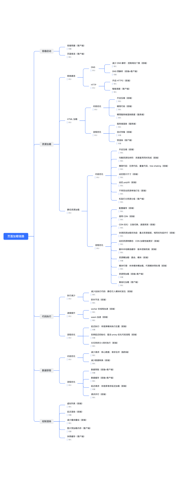

我在简历上写了精通 H5，结果面试官上来就问：

> **同学，你说你精通 H5 ，那你能不能说一下怎么实现 H5 秒开？**

<!-- more -->

  

由于没怎么做过性能优化，我只能凭着印象，断断续续地罗列了几点：

> -   网络优化：http2、dns 预解析、使用 CDN
> -   图片优化：压缩、懒加载、雪碧图
> -   体积优化：分包、tree shaking、压缩、模块外置
> -   加载优化：延迟加载、骨架屏
> -   ...

  

看得出来面试官不太满意，最后面试也挂了。于是我请教了我的好友 Gahing ，问问他的观点。

> Gahing：
>
> 你列的这些优化手段本身没啥问题，如果是一个工作一两年的我会觉得还可以。但你已经五年以上工作经验了，需要有一些系统性思考了。

  

好像有点 PUA 的味道，于是我追问道：**什么是系统性的思考？**

> Gahing：
>
> 我们先说回答方式，你有没有发现，你回答时容易遗漏和重复。
>
> 比如说「图片懒加载」，你归到了「图片优化」，但其实也可以归到「加载优化」。同时你还漏了很多重要的优化手段，比如资源缓存、服务端渲染等等。
>
> 究其原因应该是缺少抽象分类方法。

  

那针对这个问题，应该如何分类回答？

> Gahing：
>
> 分类并非唯一，可以有不同角度，但都需遵从 **MECE 原则（相互独立、完全穷尽）** ，即做到**不重不漏**。
>
> -   **按页面加载链路分类**：容器启动、资源加载、代码执行、数据获取、绘制渲染。
>
> -   **按资源性能分类**：CPU、内存、本地 I/O、网络。该分类方法又被叫做 [USE 方法（Utilization Saturation and Errors Method）](https://www.brendangregg.com/usemethod.html)。
>
> -   **按协作方分类**：前端、客户端、数据后台、图片服务、浏览器引擎等。
>
> -   **按流程优化分类**：**前置、简化、拆分**。
>
>     -   前置即调整流程，效果上可能是高优模块前置或并行，低优模块后置；
>     -   简化即缩减或取消流程，体积优化是简化，执行加速也是简化；
>     -   拆分即细粒度拆解流程，本身没有优化效果，是为了更好的进行前置和简化。
>     -   这个角度抽象层次较高，通常能回答出来的都是高手。
>
> -   **多级分类**：使用多个层级的分类方法。比如先按页面加载链路分类，再将链路中的每一项用协作方或者流程优化等角度再次分类。突出的是一个系统性思维。
>
> 选择好分类角度，也便于梳理优化方案的目标。

  

现在，尝试使用「页面加载链路+流程优化+协作方」的多级分类思维，对常见的首屏性能优化手段进行分类。

  

PS: 可以打开<a href="https://itoutiao.feishu.cn/docx/UGSDdvpXuo7FzQxyfxUcPUgxnZe" target="__blank">飞书文档原文</a>查看思维导图

  

  

**好像有点东西，但是我并没有做过性能优化，面试官会觉得我在背八股么？**

> Gahing:
>
> 可以没有实操经验，但是得深入理解。随便追问一下，比如「页面预渲染效果如何？有什么弊端？什么情况下适用？」，如果纯背不加理解的话很容易露馅。
>
> 另外，就我个人认为，候选人拥有抽象思维比实操经验更重要，更何况有些人的实操仅仅是知道怎么做，而不知道为什么做。

  

  

**那我按上面的方式回答了，能顺利通过面试么 🌝 ？**

> Gahing:
>
> 如果能按上面的抽象思维回答，并顶住追问，在以前应该是能顺利通过面试的（就这个问题）。
>
> 但如今行业寒冬，大厂降本增效，对候选人提出了更高的要求，即`系统性思考`和`业务理解能力`。
>
> 从这个问题出发，如果想高分通过，不仅需要了解优化方案，还要关注研发流程、数据指标、项目协作等等，有沉淀自己的方法论和指导性原则，能实施可执行的 SOP。。

  

  

最后，我还是忍不住问了 Gahing ：**如果是你来回答这个问题，你会怎么回答？**

> Gahing:
>
> H5 秒开是一个系统性问题，可以从深度和广度两个方向来回答。
>
> 深度关注的是技术解决方案，可以从页面加载链路进行方案拆解，得到容器启动、资源加载、代码执行、数据获取、绘制渲染各个环节。其中每个环节还可以从协作方和流程优化的角度进一步拆解。
>
> 广度关注的是整个需求流程，可以用 [5W2H](https://wiki.mbalib.com/wiki/5W2H%E5%88%86%E6%9E%90%E6%B3%95) 进行拆解，包括：
>
> -   优化目标（What）：了解优化目标，即前端首屏加载速度
> -   需求价值（Why）：关注需求收益，从技术指标（FMP、TTI）和业务指标（跳失率、DAU、LT）进行分析
> -   研发周期（When）：从开发前到上线后，各个环节都需要介入
> -   项目协作（Who）：确定优化专项的主导方和协作方
> -   优化范围（Where）：关注核心业务链路，确定性能卡点
> -   技术方案（How）：制定具体的优化策略和行动计划
> -   成本评估（How much）：评估优化方案的成本和效益。考虑时间、资源和预期收益，确保优化方案的可行性和可持续性。
>
> 通过 5W2H 分析法，可以建立系统性思维，全面了解如何实现 H5 秒开，并制定相应的行动计划来改进用户体验和页面性能。

  

* * *

限于篇幅，后面会单独整理两篇文章来聊聊关于前端首屏优化的系统性思考以及可实施的解决方案。

👋🏻 Respect！欢迎一键三连 ~
