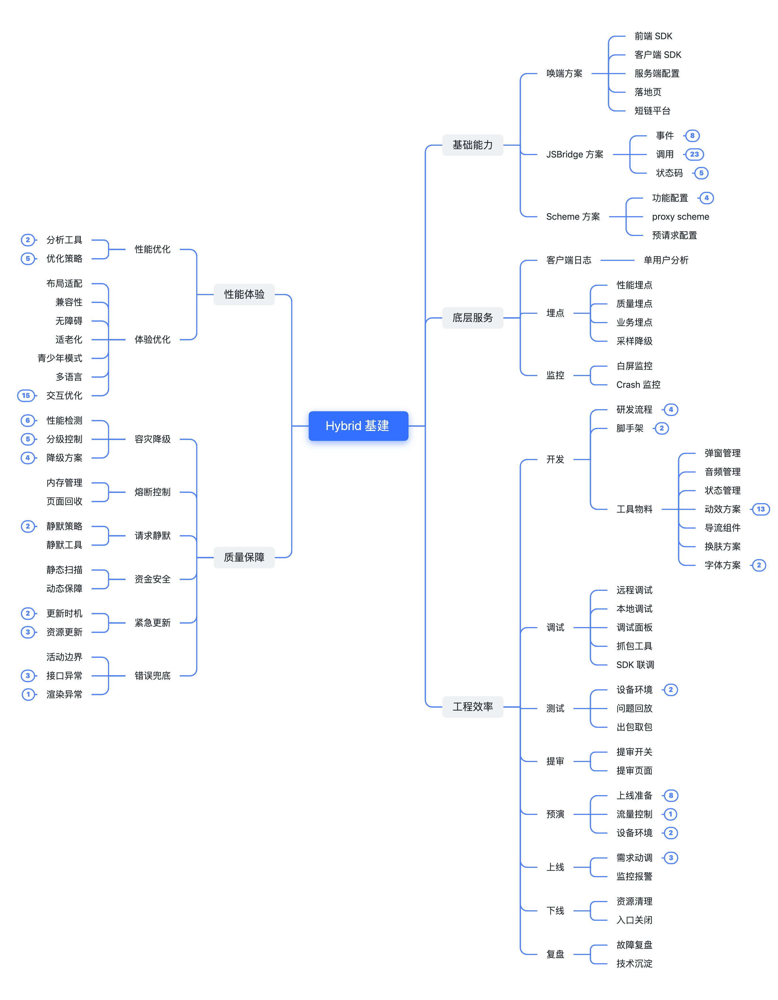

在之前的项目经历中，接触了比较多的 Hybrid 业务，因此系统性地整理了下大厂 Hybrid 业务涉及的基建和流程。

<!-- more -->

主要以前端视角为主，也会涉及到跨领域的建设，包括客户端、服务端。

其中的大多数基建是需要有专门的技术基建团队支持的，对于业务部门同学来说，更多的是了解需要什么以及为什么。

脑图会持续在「[Hybrid 基建](https://itoutiao.feishu.cn/mindnotes/TOs3b1YRvmWkPcnMVoAcR5nHnIf#mindmap)」这个文档维护，并贴上见解以及可实施的解决方案