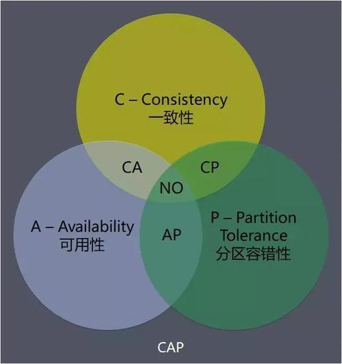
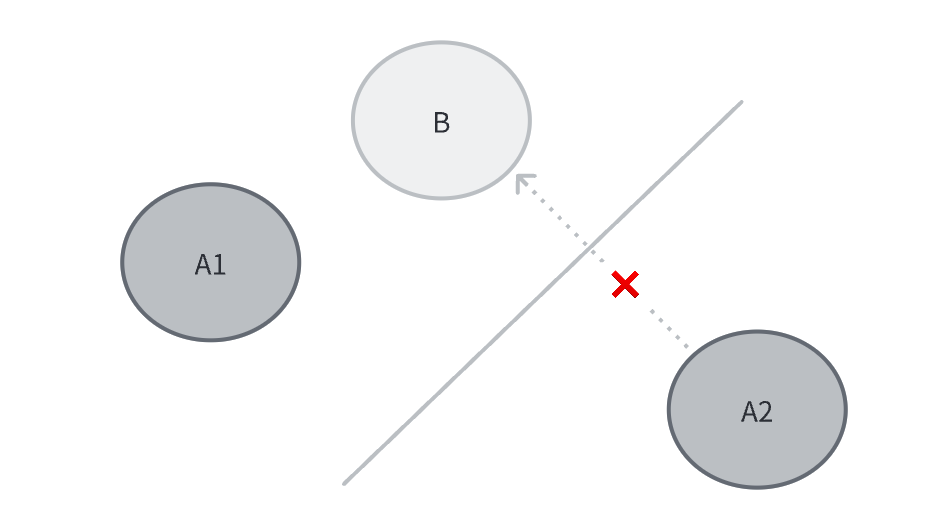
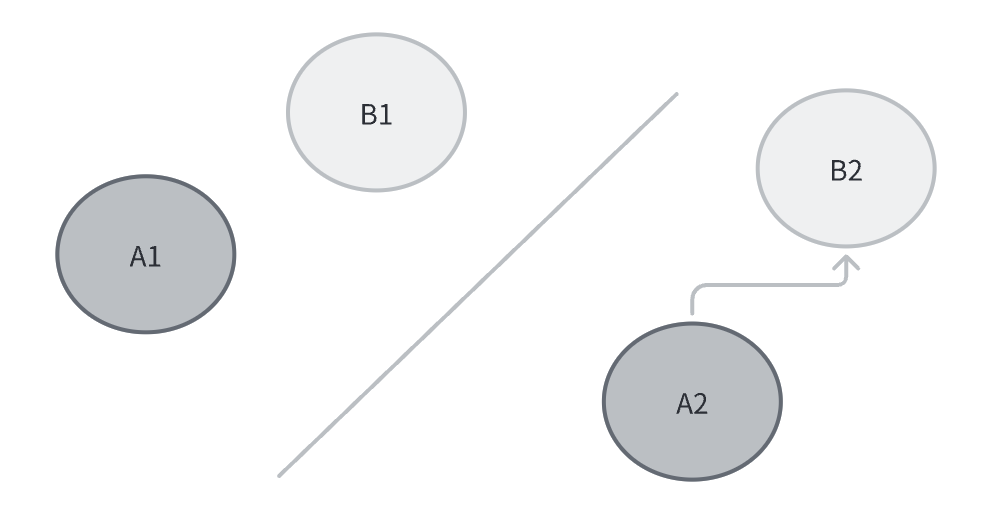

[CAP 理论](https://zh.wikipedia.org/wiki/CAP%E5%AE%9A%E7%90%86)指出在分布式系统中，不可能同时满足以下三点：一致性(Consistency) 、可用性(Avaliability) 、分区容错性(Partition tolerance)。

<!-- more -->

要理解 CAP ，首先要知道节点和分区的概念：
> 在分布式系统中，每个服务称之为节点，用于存放数据或处理数据，节点间的通信形成一个节点网络。
节点网络本应互通，但因为一些故障（网络或机器原因），导致某些节点无法连通，网络将被分割为几块区域。数据散落在这些不连通的区域，形成分区。

如果数据仅在一个节点中保存，那么出现分区后，和这个节点不连通的其他分区将无法访问此节点数据，此时分区是**不可容忍**的。
但若把数据复制到多个节点，保证每个分区都有这个数据，那么此时分区就是**容错**的。

但是，将数据复制到多个节点将带来**一致性**的问题。比如 A1 修改了 B1 的数据，此时 A2 读取 B2 数据时会出现不一致。要**保证数据一致性**，需要每次写操作的时候保证所有节点写入成功，在此之前的读操作需要等待。

但这又会引入**可用性**的问题，等待时长越长，可用性越低 **（** **CP** **系统）** 。要想实现**可用性**，就不能等待，直接获取节点数据，但这就丧失了**一致性（** **AP** **系统）** 。

如果既想**可用性**，又想**一致性**，那就保证节点仅存在一个分区，退化为单机系统，但这就丧失了分区容错性 **（AC 系统）** 。

因此，重新给 CAP 的每一项做下定义：

-   一致性(Consistency) ：每次请求都能拿到同一份最新的数据
-   可用性(Avaliability)：每次请求都能得到应答，但是不保证获取的数据为最新数据
-   分区容错性(Partition tolerance)：通过复制节点数据到各个分区，避免故障导致节点数据无法访问

**一句话总结**：数据存在的节点越多，分区容错性越高。但数据更新时要变更的节点也越多，一致性就很难保证。为了保证一致性，等待所有节点更新完成的时间就越长，可用性就越差。

## 拓展阅读

- [CAP理论中的P到底是个什么意思？ - 邬江的回答 - 知乎](https://www.zhihu.com/question/54105974/answer/139037688)
- [CAP理论中的P到底是个什么意思？ - 四猿外的回答 - 知乎](https://www.zhihu.com/question/54105974/answer/1643846752)
- [谈谈分布式系统的CAP理论 - 知乎](https://zhuanlan.zhihu.com/p/33999708)
- [wiki](https://zh.wikipedia.org/wiki/CAP%E5%AE%9A%E7%90%86)