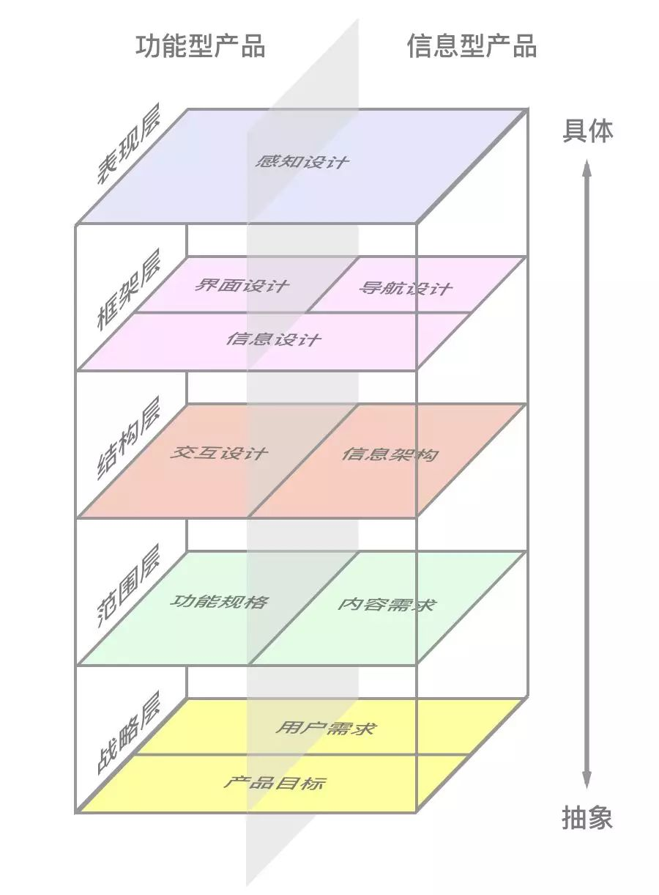

对产品设计进行5个层级的划分，从“抽象”逐步到“具体”：

- 战略层：对应产品目标，用户需求。战略是对目标，需求的商业化方案的归纳。
- 范围层：对应产品的信息和功能点，涉及到产品的侧重点和取舍。
- 结构层：对应产品的实际落地，产品在这个层面开始具体化。
- 框架层：对应产品具体内容的呈现，产品进一步具体化，落实到界面。
- 表现层：对应产品的视觉传达和交互体验，是产品的美化。

## 使用场景

## 注意事项

## 示例

## 拓展阅读

