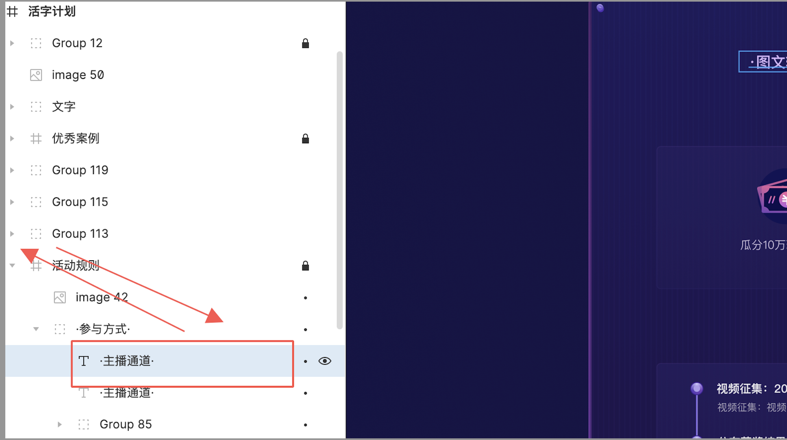
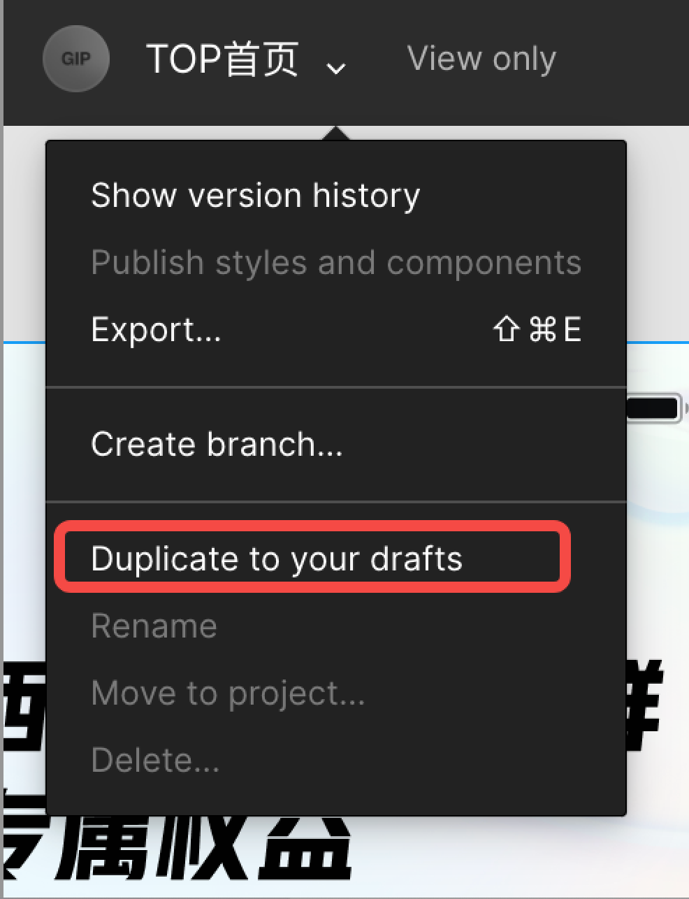
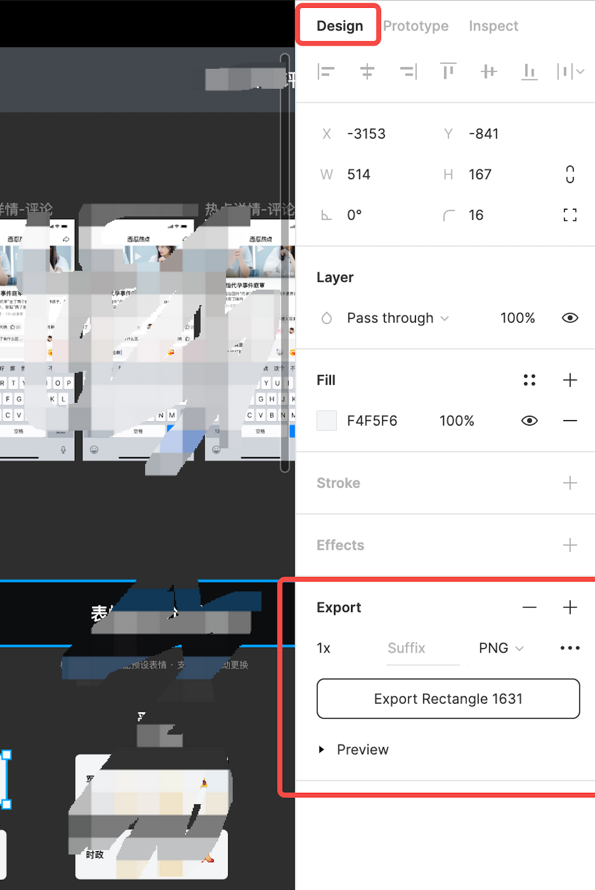

几个使用 Figma 的小技巧

<!-- more -->

## 1️⃣ 修改文本

## 背景

前是叫 UI 帮忙切图，图里面有文字。然后有个文字产品想要调整下，不想麻烦UI重新切图。怎么办？

### 方案
1. 由于 UI 给的文档自己没有编辑权限，所以需要拷贝一份。在文件列表中，选中相应 figma 项目->右键选中 duplicate 即可复制一份

2. 双击文本进行编辑，正常情况下会提示字体缺失。而 mac 系统是有这些字体库的，这时就应该开启「使用本地字体库功能」：
    1. 进入个人设置页
    2. 切到 font ，会有个按钮让下载应用，点击进行安装即可。
    3. 最后 font 显示如下

这时双击就可以正常编辑文本了

### 常见问题
1. 还是提示没有相应字体
去网上下相应字体

2. 双击时无法选中文本
编组的问题，可以将文本移到组外部，编辑完再放回来

## 2️⃣ 切图

### 背景
设计师给的 figma 地址，自己不能按需切图

### 解决方案
1. 自己拷贝一份（标题的地方选择drafts 选项）

2. 调整好格式后，点击 Export 即可

