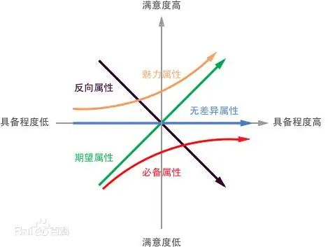

通过分析「需求实现程度」与「用户满意度」的影响，将需求分为以下5种类型：
- 基本（必备）型质量——Must-be Quality/ Basic Quality
- 期望（意愿）型质量——One-dimensional Quality/ Performance Quality
- 兴奋（魅力）型质量—Attractive Quality/ Excitement Quality
- 无差异型质量——Indifferent Quality/Neutral Quality
- 反向（逆向）型质量——Reverse Quality，亦可以将 'Quality' 翻译成“质量”或“品质”。

## 使用场景

## 注意事项

- 通常用于 C 端产品分析，B 端较少用

## 示例

## 拓展阅读
- [百科](https://baike.baidu.com/item/KANO%20%E6%A8%A1%E5%9E%8B/19907824)