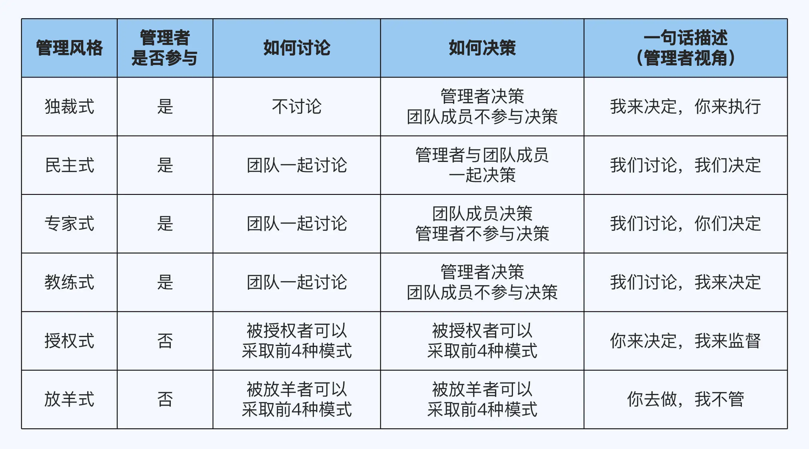
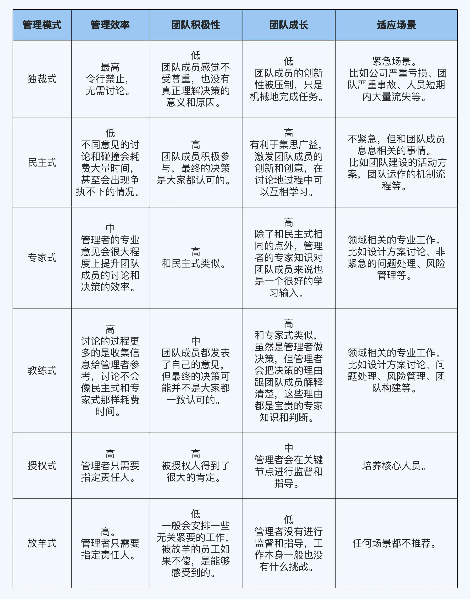

本文总结自[《大厂晋升指南》](https://time.geekbang.org/column/intro/100064501)

<!-- more -->

## 管理四象限 - 小白构建管理框架

从管理的手段和范围来进行拆解

手段：
- 管：强制，从上往下压
- 理：辅助，从下往上托

范围：
- 人：团队成员，想方设法发挥出人最大的潜能
- 事：团队要做的事，想方设法带领团队为公司获取最大的价值

## 管理五模式 - 高手进阶

应用「管理四象限」后，还会存在以下问题：
1. 每个人精力有限，无法面面俱到
2. 没有人是全知全能
3. 团队积极性和认可度很重要

根据管理者是否参与、团队如何讨论、如何决策这三个维度，得到 6 种不同的管理模式

没有万能模式，应该讲究随机应变，不同场景不同模式。

### 每种模式的注意事项

1. 独裁式：空降领导，需要克制「大干一场」
2. 民主式：注意「假民主、真独裁」，团队成员附和；可以采用不说意见、最后说意见、匿名投票等方式避免
3. 专家式和教练式：不要装内行，不熟的领域找真正的专家帮助
4. 授权式：定期监督，避免变成放羊式。可以让被授权者按照 PDCA 执行，关键节点汇报。
5. 放羊式：任何情况都不可行

### 应用指南

1. 新晋管理者如果不能灵活运营，至少可以采取民主式管理作为保底手段。
2. 无论采取什么管理模式，最终结果的第一责任人始终都是管理者自己

