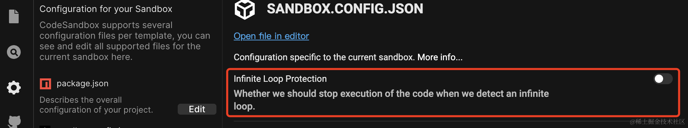
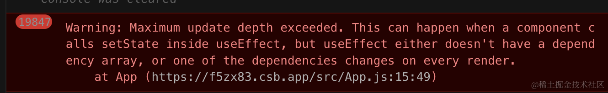

# 背景

之前做的一个需求，需要探测用户 js 代码是否存在死循环。若发现死循环，则提前抛错，而不是继续执行直至线程卡死。


<!-- more -->

业界也有挺多类似的需求，比如 CodeSandbox 沙盒的 Infinite Loop Protection，可以避免用户在调试代码时写了死循环导致页面标签崩溃。



  


能否通过静态分析的方式检测出死循环？如果不能，我们又应该如何在不借用其他线程的情况下，解决死循环卡住问题？

下面就让我们一起来分析下这些问题吧。

# 死循环 Case

什么情况下会导致死循环？列举了常见的几种情况：

1.  无限循环：循环条件始终为正 ，且循环体中没有中断语句
1.  无限递归调用
1.  无限渲染：表现在 React 等视图框架，渲染函数执行时又触发了数据变动
1.  ...

## 无限循环

```js
while (true) { // 循环条件也可能是一个很复杂、有外部入参的判断语句，但始终为正
  // 死循环
  if(1 !== 2) { // 中止条件永不触发
      return
  }
}
```

这类场景，循环条件始终为正，而在循环体中，要么没有中止条件，要么中止条件永远不触发，进而导致线程卡死。

## 无限递归调用

```js
(function recursive() {
  recursive(); // 死循环
})();
```

对于这类情况，执行引擎在达到最大递归调用栈深度后，便会抛出 RangeError ，我们无需主动处理。

```
RangeError: Maximum call stack size exceeded
```

  


## 无限渲染

这里以 React 框架为例，在 render 函数中又触发了数据的变更。这边的用例比较直白，现实中的用例可能会非常隐蔽。

  


```js
import React from "react";

export default class App extends React.Component {
  constructor() {
    super();
    this.state = {
      num: 1
    };
  }
  render() {
    this.setState((state) => ({ state: state + 1 }));
    return <div>{this.state.num}</div>;
  }
}
```

  


```js
import React, { useState, useEffect } from "react";

export default function App() {
  const [count, setCount] = useState(0);
  useEffect(() => {
    setCount(count + 1); // infinite loop
  }, [count]);
  return <div>hello</div>;
}
```

第二个用例，控制台输出了以下报错，并且渲染卡死。



  


  


# 检测死循环

能否通过静态分析的方式，检测出一段代码存在死循环？

先考虑第一种 **「无限循环」** 场景，如果我们发现**循环条件**执行结果始终为 true ，且**循环体**中没有中止语句（throw/return/break），那么这类用例必定是死循环。

```js
while(true) {
    // 死循环
}
```

然而这样的代码毕竟是少数，大部分用例是在不经意间写出死循环的，比如

```js
while (x > y && (x % 2 === 0 || y % 2 === 1)) {
  // 死循环，复杂条件难以分析
}
```

> 判断复杂、涉及外部输出，需要运行时分析，故纯静态分析难以判断

  


该问题在可计算性领域被称为[停机问题](https://zh.wikipedia.org/wiki/%E5%81%9C%E6%9C%BA%E9%97%AE%E9%A2%98)，已被证明无法通过一个通用算法分析出一段代码是否存在死循环

  


# 运行时判断

既然静态分析无法解决，那么是否换个思路：给循环体加点判断代码，当循环次数过多或者循环执行过久的时候，就认为是死循环，并抛出异常。

我们先以**执行过久**作为死循环判断条件 **（后面会继续优化）** ：

-   对于无限循环的场景，可以这么处理：

```js
while(true) {
    // 死循环
}

// 调整为

let _loopStart = Date.now() 
while(true) {
    if(Date.now() - _loopStart > MAX_TIMEOUT) {
        throw new RangeError('Potential infinite loop: exceeded')
    }
    // 死循环
}
```

> for 循环、do...while 循环同理转换。

-   对于循环的场景，可以这么处理：

```js
import React from "react";

let _loopStart = Date.now() 
export default class App extends React.Component {
  constructor() {
    super();
    this.state = {
      num: 1
    };
  }
  render() {
    if(Date.now() - _loopStart > MAX_TIMEOUT) {
        console.warn('Potential infinite loop: exceeded')
        return;
    }
    this.setState((state) => ({ state: state + 1 }));
    return <div>{this.state.num}</div>;
  }
}
```

  


现在，我们就拥有了中止无限循环代码的能力。

  


至于代码是如何插入的，下一节会给出 babel 插件代码。

  


现在的问题是，使用执行时长作为判断条件，是否合理？上面的第二个用例「无限渲染」很明显就不正确，另外涉及异步场景，也依然有问题。

```js
for(let i=0;i<10;i++){
    await fetch('/xxx')
}
```

## 用频率代替时长

我们可以换个思路，统计两次循环之间的间隔。若足够小，说明是同步代码死循环；若足够大，说明是异步循环调用，可以不用考虑。

关于足够小，我们可以粗浅的以 4ms 作为界限。通常来说， 1ms 能够执行数百次指令，只要循环体中的代码不是非常复杂，通常都能够在 4ms 内返回。再加入**最大执行次数**进行综合判断

```js
while(true) {
    // 死循环
}

// 调整为
const MAX_ITERATIONS = 2000 // 最大可循环次数
const MAX_INTERVAL = 4 // 最大执行间隔
let lastDate = Date.now() 
let loopCount = 0
while(true) {
    loopCount++
    if(Date.now() - lastDate <= MAX_INTERVAL && loopCount % MAX_ITERATIONS === 0) {
        throw new RangeError('Potential infinite loop: exceeded')
    } else {
        lastDate = Date.now()
    }
    // 死循环
}
```

# Babel 处理

根据上面的分析，我们可以使用 babel 写一个插件快速验证

> 关于 babel 插件的知识，可以查看[中文官方文档](https://github.com/jamiebuilds/babel-handbook/blob/master/translations/zh-Hans/plugin-handbook.md)

```js
const MAX_ITERATIONS = 2000; // 最大迭代次数
const MAX_INTERVAL = 4; // 最大执行间隔

module.exports = ({ types: t, template }) => {
  // 生成循环体判断条件
  const buildGuard = template(`
    %%iterator%%++
    if (%%iterator%% % %%maxIterations%% === 0 && Date.now() - %%lastDate%% <= %%maxInterval%%) {
      throw new RangeError('Potential infinite loop: exceeded ');
    } else {
        %%lastDate%% = Date.now()
    }
  `);

  return {
    visitor: {
      "WhileStatement|ForStatement|DoWhileStatement": (path) => {
        // 新增变量：执行次数
        const iterator = path.scope.parent.generateUidIdentifier("loopIt");
        const iteratorInit = t.numericLiteral(0);
        path.scope.parent.push({
          id: iterator,
          init: iteratorInit,
        });
        // 新增变量：上次执行时间
        const lastDate = path.scope.parent.generateUidIdentifier("lastDate");
        const lastDateInit = t.callExpression(
          t.memberExpression(t.identifier("Date"), t.identifier("now")),
          []
        );
        path.scope.parent.push({
          id: lastDate,
          init: lastDateInit,
        });

        // 插入循环体
        const guard = buildGuard({
          iterator,
          maxIterations: t.numericLiteral(MAX_ITERATIONS),
          lastDate,
          maxInterval: t.numericLiteral(MAX_INTERVAL) 
        });
        // 处理 No block statement 的情况，比如 `while (1) 1;`
        if (!path.get("body").isBlockStatement()) {
          const statement = path.get("body").node;
          path.get("body").replaceWith(t.blockStatement([guard, statement]));
        } else {
          path.get("body").unshiftContainer("body", guard);
        }
      },
      // 类组件函数，略
      ClassDeclaration: (path, file) => {},
      // 箭头函数组件，略
      VariableDeclaration: (path, file) => {
        // 判断是否为 JSX 函数，可以通过 ReturnStatement 是否为 JSXFragment/JSXElement 进行判断
      },
      // 普通函数组件，略
      FunctionDeclaration: (path, file) => {},
    },
  };
};
```

测试一下

```js
const babel = require("@babel/core");

// 测试插件
const code = `

while(true){
    for(;;) {

    }
}
`;

const result = babel.transformSync(code, {
  plugins: [require("./plugin")],
  // presets: ["@babel/preset-env"],
});

console.log(result.code);
```

得到如下输出

```js
"use strict";

var _loopIt = 0,
  _lastDate = Date.now();
while (true) {
  var _loopIt2 = 0,
    _lastDate2 = Date.now();
  _loopIt++;
  if (_loopIt % 2000 === 0 && Date.now() - _lastDate <= 4) {
    throw new RangeError('Potential infinite loop: exceeded ');
  } else {
    _lastDate = Date.now();
  }
  for (;;) {
    _loopIt2++;
    if (_loopIt2 % 2000 === 0 && Date.now() - _lastDate2 <= 4) {
      throw new RangeError('Potential infinite loop: exceeded ');
    } else {
      _lastDate2 = Date.now();
    }
  }
}
```

正好满足我们的需求。

# 最后

需要再次声明的是，本文提供的方案仅处理了常见了无限循环用例。

在实际项目中，用户可以通过 `eval` 、 ` new Function` 等各种方案脱离这个检测机制，难以完全避免。

此时可能需要想的是，用户都这么写了，那我们还需要为他考虑么？

  


# 拓展阅读

-   https://repl.it/site/blog/infinite-loops
-   https://github.com/freeCodeCamp/loop-protect
-   https://github.com/facebook/react/blob/main/scripts/babel/transform-prevent-infinite-loops.js
-   [如何探测 JS 代码中的死循环](https://zhuanlan.zhihu.com/p/23954773)
-   [停机问题 - wiki](https://zh.wikipedia.org/wiki/%E5%81%9C%E6%9C%BA%E9%97%AE%E9%A2%98)
