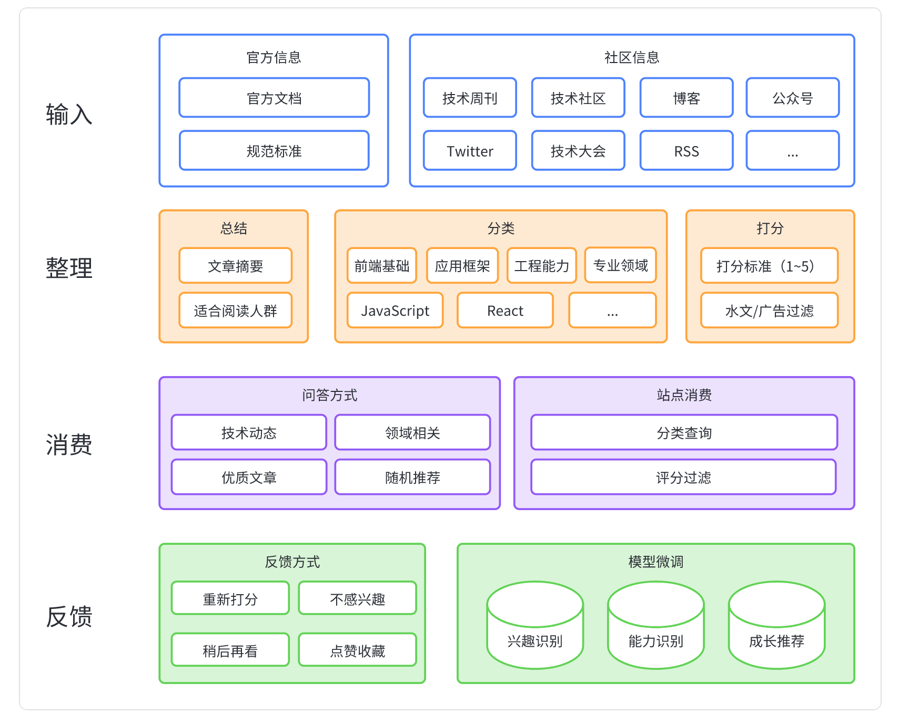

在当今快节奏的信息时代，前端开发行业的变化和进步非常迅速。作为前端开发者，获取优质信息并不断学习是保持竞争力的关键。

如何高效获取优质信息？在此之前，我们需要先解决一个问题 —— 什么样的信息才算做优质信息。

<!-- more -->

# 何为优质信息

优质信息通常拥有这三种特点： `权威性、实用性和及时性`

- 权威性：各种官方文档和规范，如 W3C 规范、React 官方文档等。这些信息是权威的，可以提供准确和可靠的技术参考。
- 实用性：各种教程和社区分享，可以提供实用的技巧和问题解决方案。
- 及时性：最新的技术趋势和更新进展，能够帮助开发者跟上行业的最新动态，了解并学习新的前端开发方法和技巧。

下面，我将从`官方信息`和`社区信息`两个方向，梳理一些我认为优质的前端信息来源

> 后续只在[飞书文档](https://itoutiao.feishu.cn/docx/SAdidmcozohUmlxp29wcQtTXn2b)中更新，欢迎评论补充，一起维护~ 🤝

# 官方信息

> 采用三级索引结构，提高信息查询效率。

1. 前端基础
2. 应用框架
3. 工程能力
4. 专业领域

## 1. 前端基础

-   W3C 规范：https://www.w3.org/TR/ 
-   Whatwg 规范：https://spec.whatwg.org/ 
-   Web 领域各项技术规范索引：[The Web Platform: Browser technologies](https://html-now.github.io/)

### 1.1 编程语言

#### 1.1.1 JavaScript

-   ECMAScript 提案：https://github.com/tc39/ecma262
-   ECMAScript 规范：https://262.ecma-international.org/

#### 1.1.2 HTML

-   HTML 规范：https://html.spec.whatwg.org/multipage/

#### 1.1.3 CSS

-   CSS 2.2 规范：https://www.w3.org/TR/CSS22/
> 更多 CSS 子类规范可以到 [W3C](https://www.w3.org/TR/?title=css) 中寻找

#### 1.1.4 TypeScript

-   官网（学习资料）：https://www.typescriptlang.org/
-   官方博客（主要是更新说明，和下方内容有点重复）：https://devblogs.microsoft.com/typescript/
-   更新说明：[Documentation - TypeScript 5.1](https://www.typescriptlang.org/docs/handbook/release-notes/typescript-5-1.html)

#### 1.1.5 WebAssembly

-   官网：https://webassembly.org/
-   规范：https://webassembly.github.io/spec/
-   WebAssembly 生态：https://github.com/WebAssembly

### 1.2 浏览器生态

#### 1.2.1 Chrome

-   Devtools 更新说明：https://developer.chrome.com/tags/new-in-devtools/
-   更新说明：https://chromestatus.com/
-   Chrome 开发者团队 Blog：https://developer.chrome.com/blog/

#### 1.2.2 Chromium

-   Chromium 项目进展： https://blog.chromium.org/
-   开发者指南：https://www.chromium.org/developers/
-   项目架构介绍：https://www.chromium.org/developers/design-documents/

#### 1.2.3 Safari

-   更新日志：[Safari Release Notes | Apple Developer Documentation](https://developer.apple.com/documentation/safari-release-notes/)

#### 1.2.4 V8

-   官网（博客、开发教程）：https://v8.dev/

### 1.3 网络相关

#### 1.3.1 HTTP

-   HTTP1.1 规范：https://datatracker.ietf.org/doc/html/rfc2616
-   HTTP2.0 规范：https://datatracker.ietf.org/doc/html/rfc7540

## 2. 应用框架

### 2.1 UI 框架

#### 2.1.1 React

-   官方博客：https://react.dev/blog
-   官方教程：https://react.dev/learn
-   更新日志：https://github.com/facebook/react/blob/main/CHANGELOG.md

#### 2.1.2 Vue

-   官方文档：https://vuejs.org/
-   博客（主要是更新日志）：https://blog.vuejs.org/
-   更新日志：https://github.com/vuejs/core/blob/main/CHANGELOG.md

### 2.2 开发框架

-   Next: https://nextjs.org/
-   Umi: https://umijs.org/

## 3. 工程能力

### 3.1 编译构建

-   Vite
-   Webpack
-   Rollup
-   Rspack
-   Turbopack
-   SWC
-   Babel
-   Bun

### 3.2 Monorepo

-   Rush
-   Nx
-   Turborepo
-   Lerna

### 3.3 包管理方案

-   npm
-   yarn
-   pnpm: https://pnpm.io/
  
### 3.4 CSS 开发方案

-   Sass: https://sass-lang.com/
-   Less: https://lesscss.org/
-   PostCSS: https://postcss.org/
-   CSS Modules: https://github.com/css-modules/css-modules
-   styled-components (css-in-js) : https://styled-components.com/
-   tailwindcss (atom css) : https://tailwindcss.com/

### 3.5 工程质量

-   ESLint: https://zh-hans.eslint.org/
-   Prettier: https://prettier.io/

### 3.6 前端测试

-   Jest: https://jestjs.io/
-   puppeteer: https://pptr.dev/
-   playwright: https://playwright.dev/
-   ...

## 4. 专业领域-跨端

<!---->

### 4.1 Flutter

-   教程：https://docs.flutter.dev/
-   更新日志：https://docs.flutter.dev/release/whats-new

### 4.2 React Native

-   官网：https://reactnative.dev/
-   更新日志：https://reactnative.dev/blog

### 4.3 Electron

-   官网：https://www.electronjs.org/
-   更新日志：https://www.electronjs.org/blog

## 5. 专业领域-服务端

<!---->

### 5.1 运行时

<!---->

#### 5.1.1 Node

-   https://nodejs.org
-   更新日志：https://nodejs.org/en/blog

#### 5.1.2 Deno

-   https://deno.com/runtime
-   更新日志：https://deno.com/blog/

### 5.2 服务端框架

-   Koa: https://koajs.com/
-   Express: https://expressjs.com/
-   NestJS: https://nestjs.com/

### 5.3 服务部署

-   PM2: https://pm2.keymetrics.io/
-   midway: https://midwayjs.org/

## 6. 专业领域-xxx

# 社区信息

## 技术周刊（推荐）

> 周刊定义：固定周期（通常是一周）收集社区优质文章，生成一份带导读的文章列表。
>
> **周刊的文章已经过一轮筛选，一般来说相对优质，很少有标题党和广告。**

-   [CSS Weekly](https://css-weekly.com/) ：内容偏向 CSS
-   [JavaScript Weekly: The JavaScript Email Newsletter](https://javascriptweekly.com/)：内容偏向 JavaScript
-   [Node Weekly](https://nodeweekly.com/) ：专注于 Node.js 技术
-   [Frontend Focus](https://frontendfoc.us/) ：前端领域相关
-   [WWeb Weekly](https://wweb.dev/weekly)：前端领域相关
-   [sidebar.io](https://sidebar.io/)：每天向前端开发者提供五个链接，涵盖设计、开发和用户体验等方面的内容
-   [奇舞周刊](https://weekly.75.team/) ：前端领域相关，主要是**中文资源**
-   [分类：周刊 - 阮一峰的网络日志](https://www.ruanyifeng.com/blog/weekly/) ：技术相关，涉猎广泛
-   [MDX 前端周刊](https://mp.weixin.qq.com/mp/appmsgalbum?__biz=MjM5NDgyODI4MQ==&action=getalbum&album_id=1862545371797749761&scene=173&from_msgid=2247486493&from_itemidx=1&count=3&nolastread=1#wechat_redirect)：由阿里的云谦在维护
-   ...欢迎补充

## 技术社区

-   [DEV Community](https://dev.to/): 前端相关，相对优质，主要关注 `Top Weekly` 的文章
-   [CSS-Tricks](https://css-tricks.com/)：前端相关，相对优质，主要关注 `Popular this month` 的文章
-   [Smashing Magazine](https://www.smashingmagazine.com/)：涵盖前端开发、设计和用户体验方面的内容
-   [Medium](https://medium.com/)：涵盖技术、科学、艺术等领域知识，需要想查看前端技术文章，可以通过标签比如 [frontend-development](https://medium.com/tag/frontend-development) 找到，或者直接关注相关作者
-   [前端 - 掘金](https://juejin.cn/frontend)：国内前端新人比较多的一个技术社区
-   ...欢迎补充

## 团队博客

-   [美团技术团队](https://tech.meituan.com/)
-   [支付宝体验科技](https://www.zhihu.com/column/c_1543658574504751104)
-   [字节 Web Infra 团队](https://webinfra.org/)
-   [Taobao FED | 淘系前端团队](https://fed.taobao.org/)： 貌似已停更
-   [AlloyTeam|腾讯全端 AlloyTeam 团队](http://www.alloyteam.com/)：貌似已停更
-   [百度 FEX](https://fex.baidu.com/)：貌似已停更
-   [饿了么前端](https://zhuanlan.zhihu.com/ElemeFE)：貌似已停更
-   ...欢迎补充

## 个人博客

-   [Overreacted](https://overreacted.io/)：React 核心成员 [Dan Abramov](https://mobile.twitter.com/dan_abramov) 的博客
-   [Anthony Fu](https://antfu.me/)：Vue 核心成员 antfu 的博客
-   [阮一峰的网络日志](https://www.ruanyifeng.com/blog/)：涵盖各种技术知识，新手向，通俗易懂
-   [张鑫旭](https://www.zhangxinxu.com/)：以 CSS 内容为主
-   [Gahing's blog](https://www.gahing.top/)：本人博客（夹带私货 👀，欢迎关注/star
-   [酷 壳 - CoolShell](https://coolshell.cn/)：左耳朵耗子的技术博客，R.I.P。
-   [W3cplus](https://www.w3cplus.com/)：大漠的博客，以 CSS、动画为主
-   [Barret 李靖 | 小胡子哥的个人网站](https://www.barretlee.com/entry/)：除了技术，还有生活
-   ...欢迎补充

## 公众号

> 推几个平时看的，可能会存在一些软文推广、广告、引流

-   字节前端 ByteFE
-   ELab 团队
-   阿里巴巴终端技术
-   ByteDance Web Infra
-   前端之巅
-   政采云技术
-   阿里开发者
-   奇舞精选
-   code 秘密花园
-   前端精读评论
-   神光的编程秘籍
-   魔术师卡颂
-   前端从进阶到入院
-   ...欢迎补充

## Twitter

> 可以获取一些最新资讯，紧跟潮流

-   [Addy Osmani](https://twitter.com/addyosmani)： Google Chrome 工程师，关注前端性能优化、Web 开发工具和架构。
-   [Rachel Andrew](https://twitter.com/rachelandrew)：Google 的 Chrome DevRel 内容负责人，致力于 http://web.dev 和 http://developer.chrome.com。 CSS 工作组成员。
-   [Chris Coyier](https://twitter.com/chriscoyier)：CSS-Tricks 的创始人，关注前端开发、CSS、网站设计和用户体验。
-   [Andrew Clark](https://twitter.com/acdlite)：React 核心成员，Vercel 成员
-   [Dan Abramov](https://twitter.com/dan_abramov)：React 核心成员，关注 React、JavaScript 和前端开发。
    > PS：更多 React 核心成员的 Twitter 可以从 [Meet the Team – React](https://react.dev/community/team) 这边获取
-   [Evan You](https://twitter.com/youyuxi)：Vue.js 的创作者和核心成员，关注前端开发、JavaScript 和 Vue.js 相关的话题
-   [Sarah Drasner](https://twitter.com/sarah_edo)：Vue.js 核心团队成员，Google Web Infra 工程总监，关注前端开发、CSS、动画和可视化。
    > PS：更多 Vue 核心成员的 Twitter 可以从 [Meet the Team | Vue.js](https://vuejs.org/about/team.html) 这边获取
-   ...欢迎补充

## 技术大会

-   [Google I/O](https://io.google/)
-   [WWDC](https://developer.apple.com/wwdc/)：苹果开发者大会
-   [React Conf](https://dev.events/react)
-   ...欢迎补充

# 如何高效获取

上面提供了优质的信息源，下面将来谈谈如何高效的获取。

将从 `思维方式` 和 `效率工具` 两个角度来讲。

## 思维方式

高效的另一个说法是合理的精力管理，不是所有信息都要了解，也不是所有知识都要学习，更不是所有信息都能学到知识。

在获取到信息后，需要透过信息看到背后的知识，学习时切记：
-   多关注**知识**，少关注**信息**
-   切勿学而不用，工作相关的知识**优先**学
-   切勿学死知识，基础原理的知识**重点**学
-   减少过期知识摄入，多关注知识**时效**
-   尽量选**难**的知识点，越简单价值越小

## 效率工具

以前是怎么获取信息的？
1. 闲逛：看看公众号，刷下 Twitter ，或者阅读各大技术社区的热门文章。闲逛的缺点是关注范围太广，信噪比太低，通常闲逛 5 篇能有 1 篇文章有收获就算不错了。
2. RSS 订阅：订阅别人已经整理好的文章，通常相对优质，还提供文章总结方便按需阅读。缺点是仅订阅 RSS 可能会错漏其他优质文章，同时每个人的优质标准不一样，优质也不一定等于有用。

`RSS 订阅` 已经相对高效，但在 AIGC 时代，可以更极致一点。

> 目前在做的一个项目，待开源。读者也可以自己手动使用 ChatGPT 来做总结、分类、打分的工作。

整体链路为：收集信息-》整理信息-》消费信息，并通过反馈微调模型，让模型更懂自己，成为个人知识管理的好助手。

# 总结

本文介绍了前端优质信息的定义和获取方法。

优质信息应具备权威性、实用性和及时性，获取优质信息可以从`官方信息`和`社区信息`两个方面入手，可以参考本文提供的资源地址。

为了高效获取信息，本文提出了思维方式和效率工具两个角度的建议。在思维方式上，应该关注学习收益；在效率工具上，应该善用 AIGC 工具，提高信息获取效率。

总之，获取前端优质信息对于前端开发者来说至关重要，可以帮助在快节奏的前端领域中不断学习、成长和发展，应对未来更强的挑战。
