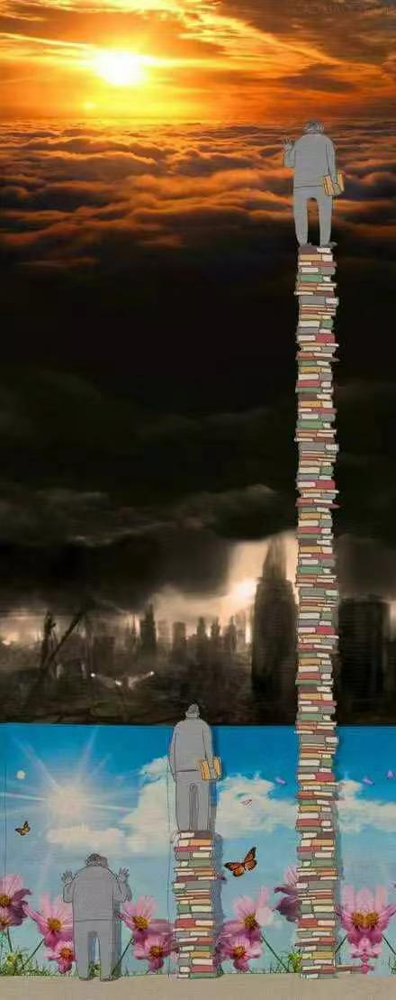

今天，刷推时看到一张图，感觉和我工作几年来的心路历程很像，特此分享下。

<!-- more -->

第一个人脚下空无一物，眼中均是美好。

第二个人读了一些书，看到美好背后的黑暗，开始陷入迷茫。

第三个人学识渊博，了解运行规律，明白世界不是非黑即白，故此看到曙光。

而我呢，目前可能还处在第二阶段，但也清楚应该继续向前，走向第三阶段。

# 第一阶段

> 无知小粉红心态

读书期间，**小镇出身的我**，比较追求应试教育和实用主义，所思所学全为了**考高分、学技术**，除此之外的素质教育全然不顾。

  

同样是去图书馆，我看的是「精通 Java」，而舍友看的是「毛选」、「中国近代史」这类的书籍。在那时，我是不屑一顾的，认为这就是 **「浪费时间」，看这些又不能当饭吃。**

  

毕业后，舍友进了体制内，而我去了一家小厂当码农。小厂也挺好，朝九晚六，不追求结婚买房，过得很快乐。

  

然而，我还是没有继续读书，**技术之外脑袋空空**，只会被动的接收主流媒体提供的资讯，从不思考内在逻辑。

  

有一次，社保税改（2018年）要求公司按员工真实收入去上报缴纳基数，也就是说社保缴纳金额变多、到手工资变少。看到群里都在吐槽，而那时的我却在群里发表了「高见」：

> 社保不也是自己的钱么，提高缴纳基数更赚么？gj 这是为我们个人谋福利！

结果招来一顿全嘲，说我「啥也不懂」。后面又工作了一段时间，我才彻底明白了他们的槽点。

  

# 第二阶段

> 生活压力，终使自己变成自己最讨厌的人

早期很喜欢逛知乎，也关注了一些前端大佬，希望学点技术。

但从某段时间开始（大概2020 左右），发现这些人很喜欢「键政」，大谈国事。

大多都是负面情绪，当时作为「小粉红」的我难以接受，于是拉黑了好几个人。

  

随着年龄上去，迫使自己需要关注技术之外的内容：房产、婚姻、生育、教育、理财、交际，往大点说，是政治、历史、和经济。

  

粗浅了解之后，我开始悲观：

-   刑不上大夫
-   十年寒窗凭什么拼得过人家三代人的努力
-   历史就是圈，教员想改变的事情是无法改变的
-   zg人的劣根性
-   tz内的劣根性

于是，我也开始键政，变成了那个曾经最讨厌的人。

  

# 第三阶段

> 探索底层逻辑

工作压力加上生活压力，使我一度抑郁，甚至产生过极端想法。

  

好在，我有一个好伴侣，是她陪我度过了那段痛苦的岁月，鼓励我多看书、多思考。

现在，我也分享下我的一些想法，虽然还未正式踏入第三阶段，但也大概摆脱了第二阶段的影响。

1.  接纳自己的平凡
2.  最重要的能力，是获得能力的能力
3.  遵从历史规律，做务实求进的人
4.  思考底层逻辑，所有**方法论**都可以通过**底层逻辑（相同之处）＋** **环境变量** **（不同之处）** 来解释
5.  提升思维认知，多学习技术之外的内容

# 最后

以上便是我工作六年的心路历程，从开始的无知，再到键政，最后开始寻求转变。

本文纯碎碎念，欢迎各位客官吐槽~
