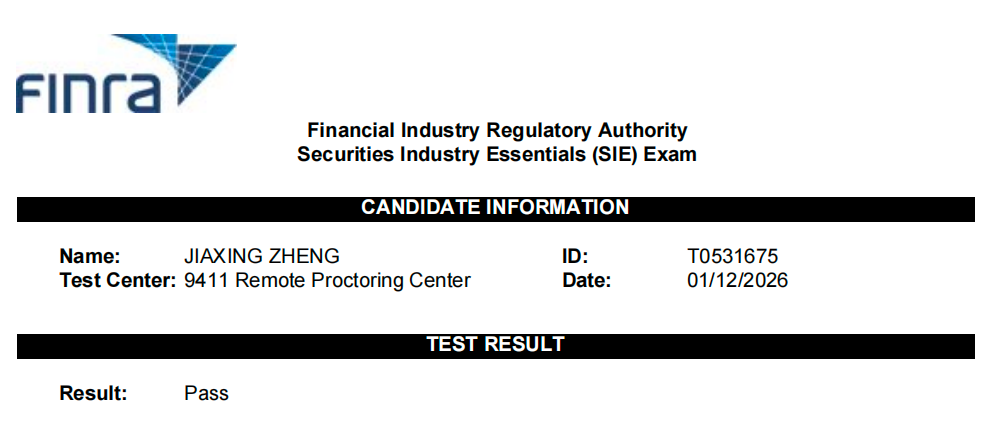
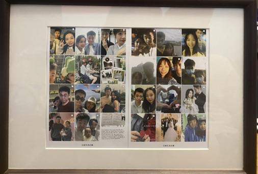
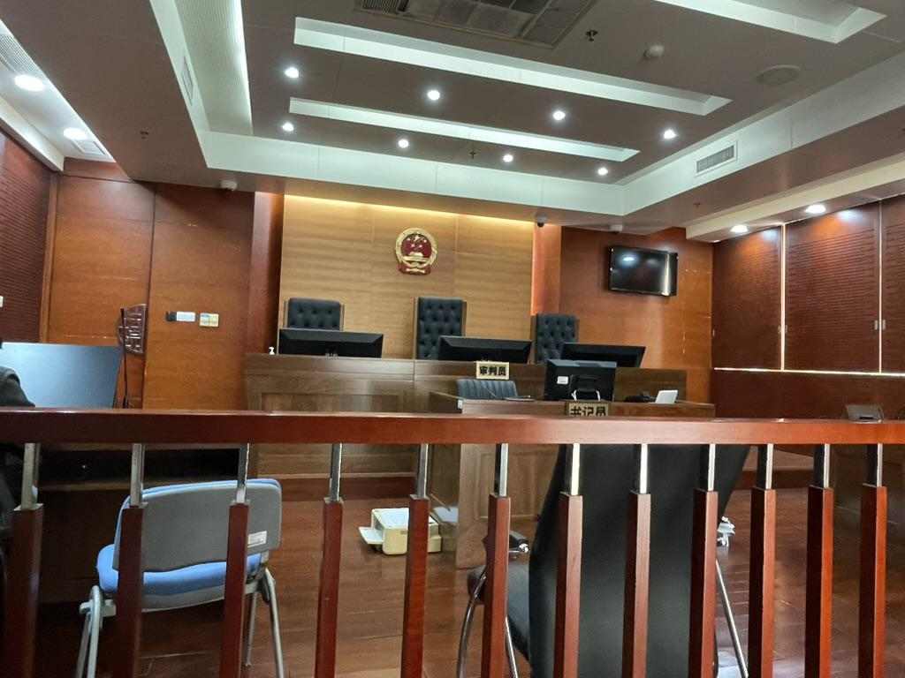
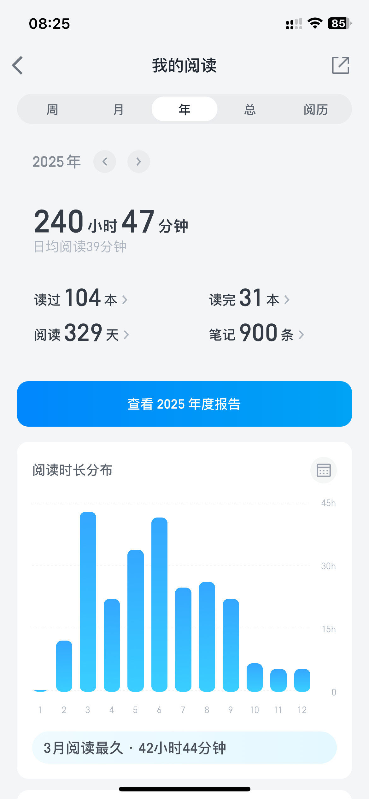
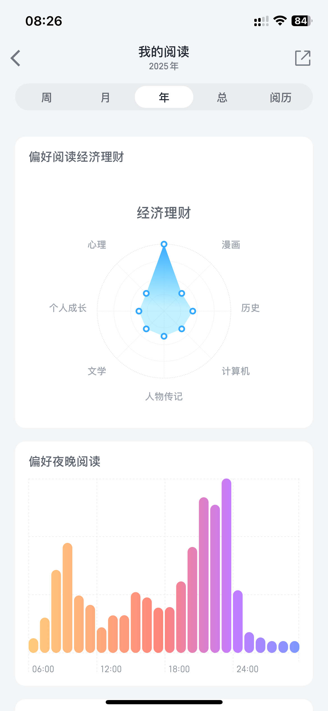
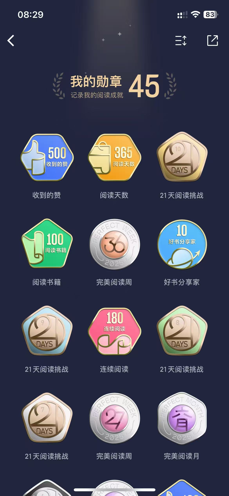
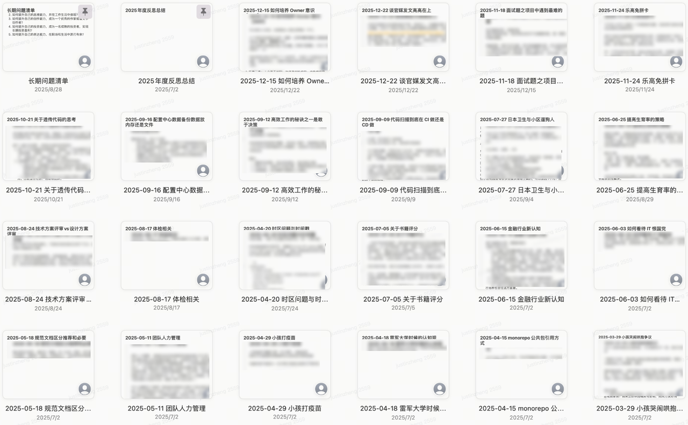

> 又到了一年一度的总结环节，今年的年度关键词是「充实」
> 附：[2024 年度总结](https://www.gahing.top/summary/2024/)

## 目标回顾

去年总结的最后，我对新的一年提出了两个期许：

1.  工作上：拥抱 AI ，最好有实际产出
2.  学习上：看完 10 本书，输出文章分享

这两个目标都已超额完成，下面顺着工作、生活、学习三个方面来聊聊今年的情况。

<!-- more -->

## 工作

作为一名金融业务研发，我把工作内容分为这 4 个方向：**业务支撑**、**项目管理**、**技术探索**、**金融学习**。

今年在业务支撑和项目管理上都做得一般，没有太多值得聊的。业务支撑主要是开展了 2 个大型重构专项以及 N 个小专项，个人认为做得不够好，业务思考太少，更多是技术决策和跨团队配合。
在项目管理方向，承担了一次中心级接口人和 N 个组内接口人。在「AU2SG 专项」上，进度和风险把控做得还可以，但方案评审没做到位导致实施上出了些问题，后续会加以改进。

在**技术探索**和**金融学习**方向收获较多，下面重点聊聊。

### 技术探索

今年的技术探索主要做了这四件事：**AI 探索**、**PDF 渲染方案预研**、**效率工具开发**、**疑难杂症解决**。

在 AI 探索上，可能还是偏研发使用：比如 Cursor Rules、MCP 等，只是为了更好的写代码，还没有应用到业务中。明年想搞一些 AI Agent，真真切切地去运用 RAG、LangChain、LangGraph 等技术，为业务赋能、为研发提效。

「PDF 模板渲染方案调研」项目是下半年我主动拉起的，目的是为了解决当下 wkhtmltopdf 技术选型的诸多问题。虽然最后因人力问题没有实际落地，但现在对于 PDF 渲染、大结单渲染等技术方案已经比较熟悉了，算是一个不错的开头，明年或许可以立个专项继续推进。

在效率工具开发方面，今年搞了两个有意思的小工具：

-   **xxx-fake**：基于内部 Node 框架的用户身份伪造插件，用于在本地或测试环境中绕过登录验证，直接模拟指定用户身份。特别适用于需要真机联调、快速测试等场景
-   **vite-plugin-x**：vite 构建套件，降低 Vite 接入成本。

并在做这些工具的过程中，发现并解决了诸多疑难问题，包括 TS 模块增强机制、 DNS 解析与 Vite host 配置分析、Egg 中间件覆盖方案等，后续脱敏后发出。

### 金融学习

往年老是说要学习业务知识，但总是学得太碎片化。今年借着业务学习专项和部门 SIE 考试的契机，也系统性地学习了下。

首先是业务学习，今年重点学的是**收费**，了解了收费业务的整个定价流程，包括收什么费、怎么收的费、定的什么价、怎么定的价，以及当下核心问题和未来规划，带着未来的视角看过去的问题才能看得更透。

接下来是金融学习的另一个重点 ------ SIE 考试 [SIE 考试](https://itoutiao.feishu.cn/wiki/WHvdwQKkDisk1ikJJudcyGzZnvd)。

学 SIE 的收获还蛮大的，即补齐了一些非常基础的金融知识（比如证券产品、交易机制、订单类型及市场参与者等），也学会通过货币供应和经济指标做证券分析，了解美国的税收规则并推测中国未来的发展。
当然现在学的还很皮毛，但个人比较有感悟的是看金融文章时没以前那么迷糊了；比如聊美联储决策、或者养老金政策，能够稍微看懂一点。
所以我推荐每个金融研发都应该去考，把通过考试当做目标，这样才能学得更深入、更持续。




### 新年规划

新的一年，主要投入 2 个方向：AI 探索和金融学习。
-   AI 探索：上半年搞懂 AI Agent、LangChain、LangGraph ，知道它们的能力范畴，下半年找个任务真正实践落地
-   金融学习：聚焦公司行动和前后台架构等业务知识，学会复式记账等金融基础。

## 生活

### 新晋奶爸

初为人父，尽量陪伴，今年在生活方面主要是带娃为主。
带娃一开始很苦，苦的点在于难以平衡时间，即平衡**娱乐、学习、睡眠、陪伴**这四个方面的时间。
后面找到节奏就还好，现在讲究高效陪伴：

1.  减少无效娱乐，规律睡眠时间
2.  轮流带娃而非一起带娃，避免每个人都很累
3.  等娃睡后再学习或加班，避免频繁打断

最后晒一下娃，一年真的很快：http://xhslink.com/o/4J3zftPC9mw

### 恋爱 10 周年


2015~2025，从校园相识到生娃育子，共同走过了 10 年。未来也会经历更多的十年。


### 第一次上法院

遭遇经典的托管租房骗局，损失1万多，上法院诉讼也追不回来，就当个教训。
小红书上有人发[这个事](http://xhslink.com/o/93V5UtT81If)，至少200多人被骗，涉案金额至少数百万，现在骗子还在继续行骗中......
因为事情没闹大、没有舆论，所以执法机构也懒得管这种事。

> PS：上过法院后，感觉也就这么一回事，都是走流程。诉讼最难的点是前期的证据收集和材料准备，真的很花时间和精力。



这里借助 5Whys 方法复盘下为什么会被骗：
```
Q：为什么会被骗？
A：因为**贪小便宜**，房租比市场价便宜了 200 块钱。
Q：为什么没有质疑房租比市场价便宜？
A：这里其实是质疑过的，但因为**过于自负**相信了托管机构的说法。托管机构答复说他们是靠房屋免租期赚钱，所以越快交易成功他们越赚，因此需要薄利多销。我自己算了笔账，也确实有赚头就是少了点。比如房租收 6000 租 5500，中间差价 500，免租期 2 个月，那只要立即租出去就能用免租期的收益覆盖掉这个成本（1个月免租期房租收入相当于11个月房租差价）
Q：为什么没有质疑过这家公司？ 
A：其实是有质疑过的，但**心理被拿捏**了。第一点是直到要签约才知道他们是托管机构而不是房产中介，当时已经看上房子想签约了，反悔沉没成本过重；第二点是他们打了包票说是贝壳加盟官方合作，于是想着如果真跑路那也有贝壳兜底。后面才发现天真了，所谓的贝壳加盟给钱就能上，贝壳根本不审核的。
```

在签约当晚就知道被骗了，这家公司迟早出事，能做的就是把损失控制在押金而不包括季付房租。所以后面 7 月份要交下一次季付房租时，邀请房东演了一出戏，把两边的合同解约了，达到损失最小化。

后续租房如何防骗？[这篇文章](https://www.wnd.gov.cn/doc/2019/05/05/2496610.shtml)务必阅读，我就简单总结 3 点：

1.  一定不要选择托管租房，深圳的托管 99% 都是雷
2.  签约后主动进行租赁合同登记备案，可以帮助发现租房合同中的不合理条款
3.  一定要选择正规的租赁平台，大平台出事了闹起来才有流量

### 新年规划

今年没有什么轰轰烈烈，更多是柴米油盐。明年想做的 3 件事是：

1.  **把娃送去托育**：工作日老人只需晚上带娃不会太累，年轻双方有更多个人时间去娱乐成长，周末再高效陪伴；
2.  **出游 2 次**：一次是带小孩周边游，可能是去广州；一次是伴侣双人游，可能去大西北，也可能去北海道；
3.  **每周健身 2 次**：带娃就像一场持续的战役，而身体就是革命的本钱。

## 学习

今年在学习方向收获颇丰，重拾阅读习惯，在个人认知方面也有所提升。

### 阅读

年初 jin 哥拉起了读书会，我给自己定的目标是：**提升沟通技巧和个人认知，培养读书习惯。**
习惯方面已经养成，现在每天都会打开微信读书阅读一会；沟通技巧和个人认知无法量化，至少自己觉得有进步那就够了。




> 10 月之后阅读时长下降，主要是在准备 SIE 考试

最后，推荐我的 2025 年度书单：

| 书籍 | 推荐语 |
| --- |  --- |
| 《史蒂夫-乔布斯传》 | 这是一本非常优秀的传记，通过不同人的视角（包括乔布斯自己）讲述了乔布斯所作所为，内容相对客观、言之有理，能够让读者正确地认识乔布斯。这里的认识不止是乔布斯的特征（简约、冷酷），还包括特质的来源，与其他纯歌颂的传记形成鲜明对比。 |
| 《认知觉醒》 | 这本书教你掌握了元认知的力量，学会及时复盘。行动力不足的原因在于选择模糊，消除模糊的方式便是量化目标拆分任务，将困难区的任务拆分到拉伸区，够得着却又有一点难度，这样成长是最快的。 |
| 《终身成长》 | 相信能力是可以发展的，这便是成长型思维；这本书会带你探索思维差异的背后，以及如何培养和传递成长型思维，打造进化内核。 |
| 《九宫格写作法》 | 这本书提到了写作上的常见错误，深入分析原因并给出解决方案，知其然并知其所以然。每个文字创作者都值得一读，或多或少能够找到自己创作上的错误，比如我的错误主要就在于缺乏感受，过于客观，文章少了人情味，自然没人想读。 |
| 《交易至简》 | 这是一本理财心法书，它告诉我们市场永远是对的，我们无法改变市场，只能改变自己。而改变自己就是要持有空杯心态、知行合一。 |

### 思维提升课

借着阅读这件事，今年建了一门思维提升课程（思维提升-程序员修炼之道），以教代学，通过分享加强学习质量。
课程目前已完成 5/7 ，争取年后回来完结，重新优化内容并对外宣发。

### 元认知

《认知觉醒》告诉了我元认知的力量，学会及时复盘。我今年开始逐步建立了自己的复盘日记，记录当下做决策时的一些思考，为什么这样思考？能不能做得更好？


### 新年规

《富足人生指南》这本书告诉我们要建立自己的长期问题清单，我的长期问题是：

1.  **如何提升自己的思维能力，并在工作生活中体现？**

2.  **如何提升自己的创作能力，成为一个优秀的作家或者文字创作者？**

3.  **如何提升自己的投资能力，成为一名成熟的投资者，实现长期投资盈利？**

4.  **如何提升自己的表达能力，在职场和生活中游刃有余？**

所以明年的学习规划会围绕这四点展开：

1.  **思维能力**：完成思维课程创作，重新优化文章内容并对外发布小册，目标 1k 点赞量

2.  **创作能力**：尝试模仿并找到自己的风格，累计对外发布 10 篇文章（技术类 5 篇、非技术类 5 篇）

3.  **投资能力**：学会阅读财报，掌握复式记账，对外输出 2 篇分享，实践上先以长期价值投资为主

4.  **表达能力**：阅读 2 本相关书籍，参与一场外部分享，录制现场回顾分析，找到问题并加以改进

## 展望 2026

工作上，聚焦 AI，持续提升个人金融专业素养；

学习上，聚焦 4 个长期问题，多读书、多分享，提升个人影响力；

生活上，高效带娃陪伴，找到自己的时间。

至此，与君共勉。