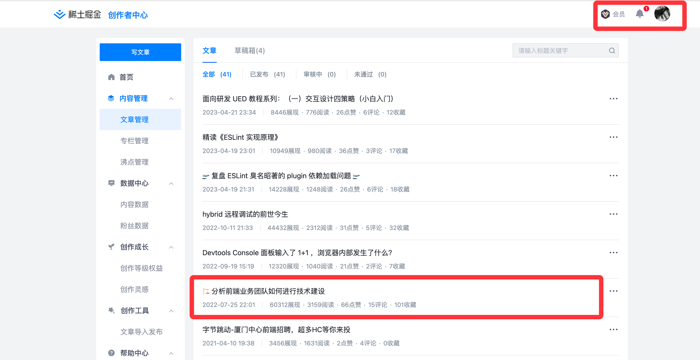

辛苦写的文章，被某些公众号未经授权直接搬运，还不带原始作者和地址（或者很隐蔽），申诉了几次才成功，分享一下经验：
1. 走投诉的话时间较长（7天内），而且搬运的可能不止一个号，投诉不完
2. 直接建一个公众号（切图仔的前端之路）自己发文章，会触发原创申诉。申诉的话比较快，写的 1~2 天，但证据足够的话通常半小时内就申诉完毕
3. 若文章不想公开，可以选择「发布」而不是「群发」，这样是也有原创保护的
4. 申诉失败可以继续申诉
5. 申诉的时候，一定要带上后台发文记录截图，不要用文章页的作者截图。
6. 申诉成功后，自己的文章就可以原创发布。后续新的搬运只能走转载，但旧的这些文章还会保留，可以选择走投诉，并带上自己公众号文章的链接，这个时候审核会变快

<!-- more -->

最后，还是得寻找一些一文多发的工具，避免被提前搬运了。

## 申诉示例

该文章为我个人在外部平台（掘金）发表，地址为 [https://juejin.cn/post/7124309631718916103](https://juejin.cn/post/7124309631718916103) 。发表时间为 2022 年 7 月，但我本人并未同步至公众号，结果该用户复制了我的文章并发表在掘金。申诉证明材料中有我本人作为这篇文章作者的证据。

