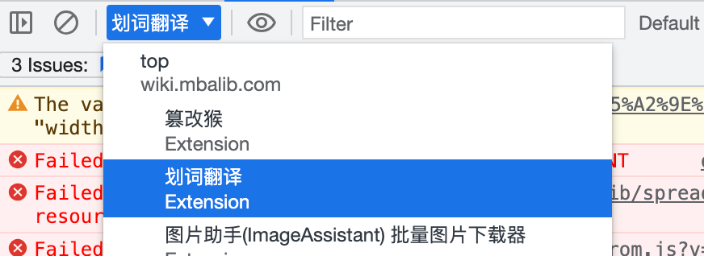

部分 Chrome 拓展存在高级功能，需要付费或开通会员才能解锁。

根据功能运行的主体不同，这些高级功能分成两种情况：
- 本地功能：功能核心逻辑在本地
- 远端功能：功能核心逻辑在远端，鉴权后生成，比如 ChatGPT 类插件的回答生成

分别进行如下权限绕过处理：
- 对于本地功能，我们可以通过接口拦截或者代码注入来绕过权限验证。
- 对于远端功能，通常我们无能为力。但如果插件提供了匿名用户的试用次数，我们则可以通过重置用户信息来绕过权限验证。


PS：声明一下，有能力的还是支持下拓展作者

<!-- more -->

## 划词翻译

### 1. 去除全文翻译限制

打开控制台，选择该拓展的执行上下文环境



控制台输入以下代码
```js
chrome.storage.local.set({pageTranslateLimit: {times: Number.MIN_SAFE_INTEGER}})
```

立即生效