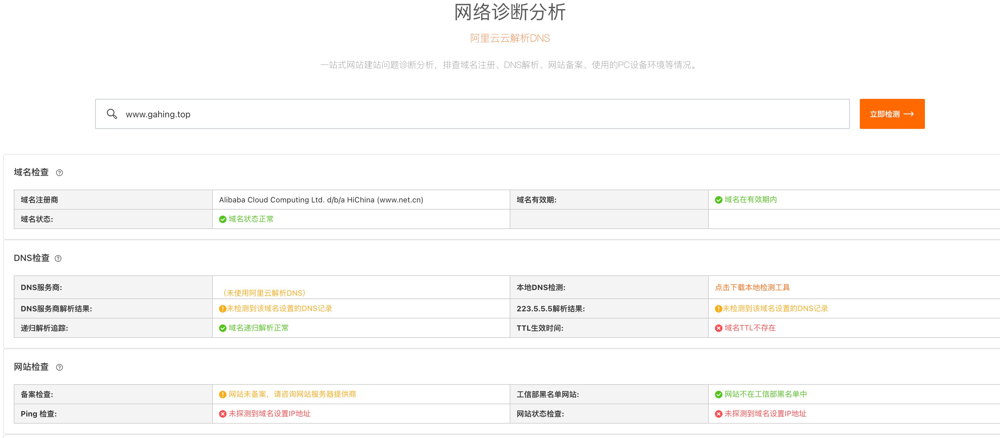
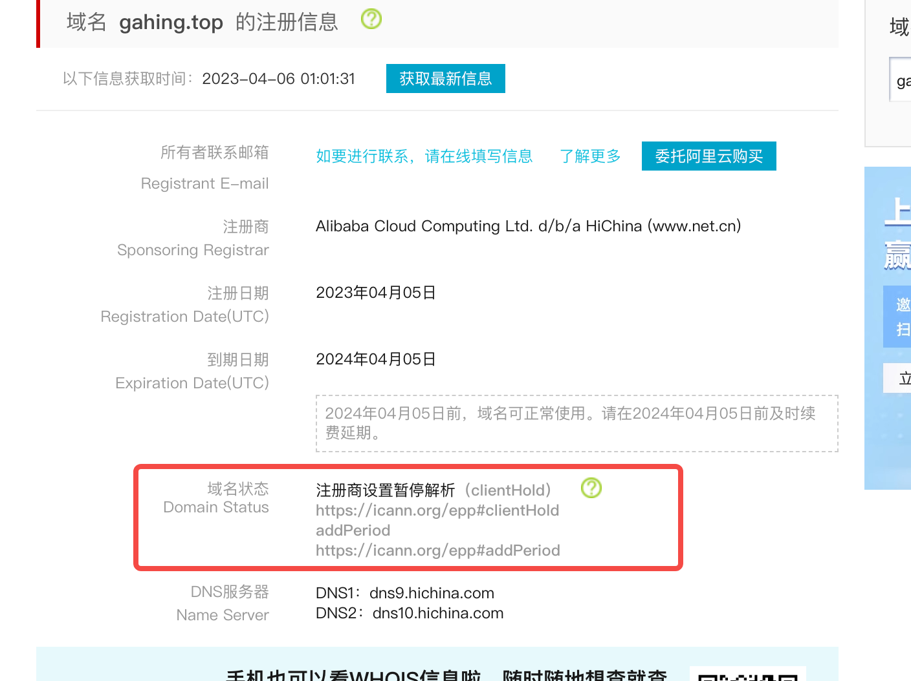

## Q: 如何测试域名解析生效

- 【推荐】使用阿里云的[诊断分析工具](https://boce.aliyun.com/home)进行测试
  > 
- 本地工具测试
- 使用 dig 或 nslookup 命令测试
- 使用阿里云的[拨测工具](https://boce.aliyun.com/detect/dns)执行全国各地运营商解析生效测试

详见：[解析生效测试方法 - 阿里云](https://help.aliyun.com/document_detail/39834.html)

## Q: 域名 DNS 解析不生效，可能是哪些原因？

- 域名状态异常
- 域名过期
- 修改域名 DNS 服务器，还未达到 48 小时的全球同步时间
- 修改过解析记录，各地的运营商 LocalDNS 还未更新缓存，需要等待 10min 缓存到期，域名解析才会生效

详见：[影响域名解析生效的原因 - 阿里云](https://help.aliyun.com/document_detail/39839.html)

## Q: 怎么确定域名状态？什么状态不能正常解析？

可以到阿里云的 [域名信息查询（WHOIS）](https://whois.aliyun.com/)中查询，观察「域名状态」，比如



如果域名处于以下几种状态，可能无法正常访问
- Pendingdelete（域名过期，赎回期）
- Redemption period（域名过期，赎回期）
- Clienthold（注册商设置暂停解析）
- Serverhold（注册局设置暂停解析）
- Inactive（未设置 DNS）

状态的具体解释可以看 [EPP Status Codes](https://icann.org/epp)

如果域名状态如果显示为 `serverHold`、`clientHold` 时，说明域名已被锁定（冻结、暂停解析），这是域名注册商/注册局对域名实施禁用的一种手段。域名被锁定之后，解析将不生效，全球用户都无法访问已被锁定的网站。

常见的被锁定情况包括：
- 被注册商锁定
- 未完成邮箱验证被锁定
- 未完成域名实名制认证被锁定
- 违规滥用被注册局锁定
- 发生纠纷或违规被锁定

如果修改了解析记录，在解析生效前可能也会处于 `clientHold` 状态，该情况无需处理等待解析更新即可

## Q: 如何解除域名锁定状态（Clienthold、Serverhold）？

详见：[如何解除域名锁定状态 - 阿里云](https://help.aliyun.com/document_detail/35810.htm)


## Q: 域名什么情况下需要备案

备案主要和服务器所在地有关：
- 如果使用国内主机或服务器建站，根据政策要求域名必须有对应的备案号；
- 如果使用香港主机或海外主机，可以免备案，包括 `vercel、github pages` 等

但需要注意一点：没有备案的域名，部分运营商可能无法正常解析，且提解封工单也不会处理

## Q: 特定的区域或运营商环境下，域名无法解析？

如果仅部分运营商无法解析，通常就是没备案导致。只能备案解决？（待确定）

## Q: 如何指定运营商进行 DNS 解析测试？

选择免费的拨测工具：
- 阿里云的[拨测工具](https://boce.aliyun.com/detect/dns)，有 200 多个全球节点，免费
- 腾讯云的[拨测工具](https://console.cloud.tencent.com/monitor/cat-immediate/creat)，需要付费
- [IPIP](https://tools.ipip.net/dns.php)，免费
- [ping.cn](https://www.ping.cn/dns)，免费，免登录
- [boce.com](https://www.boce.com/dns)

以上工具均只有部分运营商，如果没有找到合适的运营商，也可以使用本地 DNS 解析工具（比如 dig、nslookup），允许指定「运营商的 DNS 服务器地址」来进行测试。

以 dig 工具为例，命令如下：
```sh
dig @运营商的 DNS 服务器地址 待测试域名
# 向泉州电信 DNS 服务器寻找 www.gahing.top 域名的 DNS 解析结果
dig @218.85.157.99 www.gahing.top
```

运营商的 DNS 服务器可以从以下网站上找到：
- [https://dnsdaquan.com/](https://dnsdaquan.com/)

还没找到的话就网络搜索吧