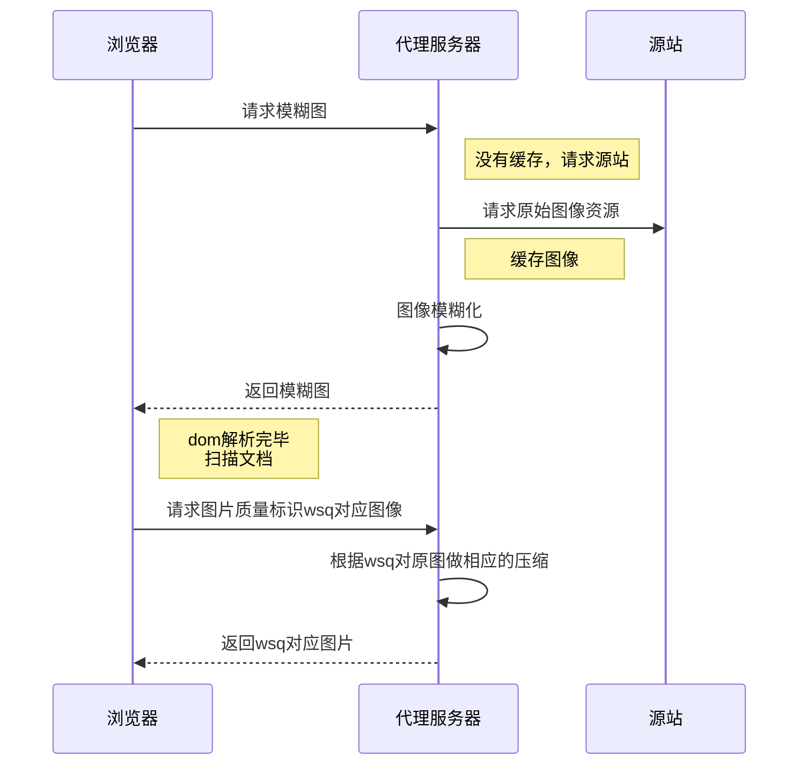
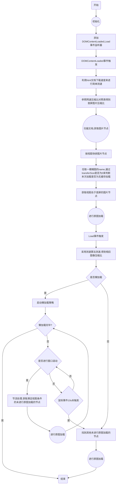
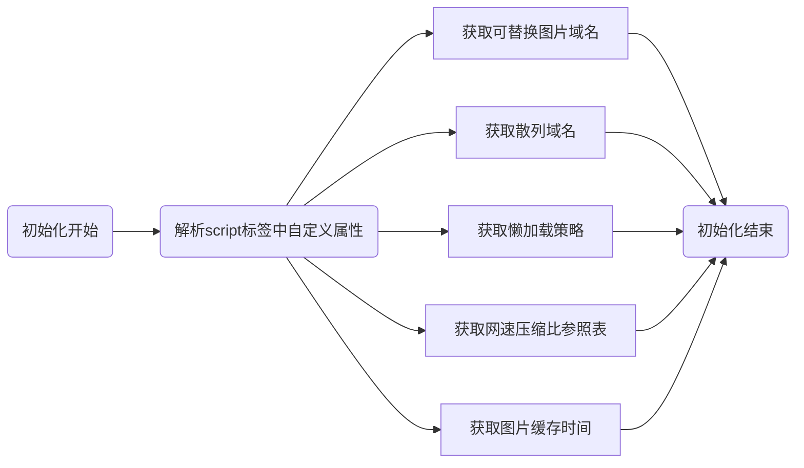
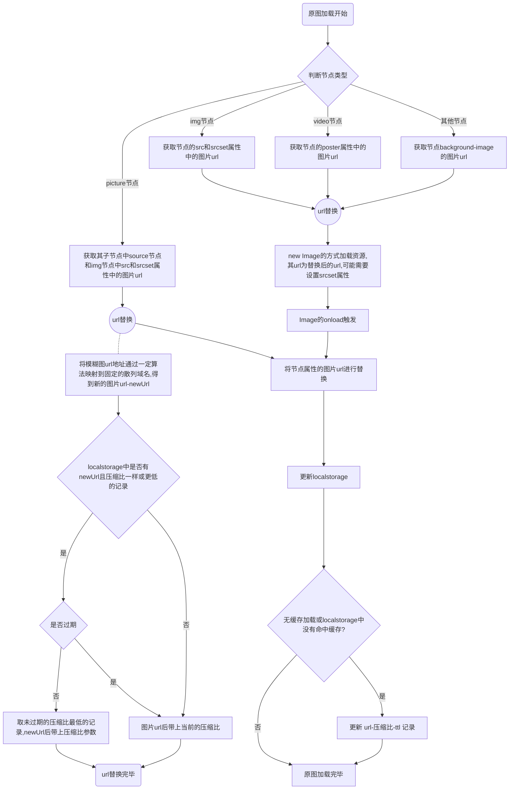
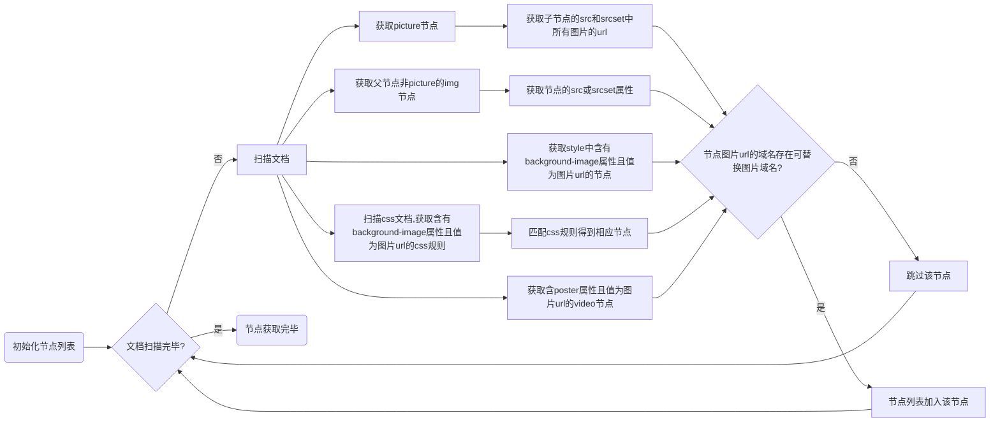

# 技术介绍

## 一、 图片懒加载

按需加载，即用户滚动页面到一定位置（可视区域）时才触发图片的加载；

常用于图片较多的网页，可以延迟网络请求，页面更快load

<!--more-->
### 效果

<a href="https://www.jd.com/">京东首页效果</a>

### 实现原理

1. ``节点不使用src属性，将图片地址放在其他自定义属性上
2. 当页面滚动到一定位置，将自定义属性上的图片地址赋值给src

主要有两种方案

#### IntersectionObserver

一个用于判断 dom 节点是否处于视口的API

</img>
      *(引用网上图片)*


  **简单代码：**
  ```js
  var intersectionObserver = new IntersectionObserver(function(entries) {
    entries.forEach(function (entry) {
      //intersectionRatio：该元素的可见性比例
      if (entry.intersectionRatio > 0) {
        //对其dom节点（entry.target）进行下一步操作
      }
    });
  },{
    // 用于计算相交区域的根元素，默认document顶层文档的视口
    root：null,
    // 指定到root的距离，用于扩大或缩小交叉区域面积,一般用于提前/延迟懒加载
    // 与margin一样跨域用4个值，允许负值
    // 显示指定root时才可使用百分比值
    rootMargin:"0px",
    // 触发回调函数的临界值，用 0 ~ 1 的比率指定，也可以是一个数组。
    // 其值是被观测元素可视面积 / 总面积
    // 当可视比率经过这个值的时候，回调函数就会被调用。
    thresholds:[0]
  });
  document.querySelectorAll('img').forEach(v=>intersectionObserver.observe(v))
  ```
  兼容性：<a href="https://caniuse.com/#search=intersectionObserver">较差，caniuse</a>

#### scroll+requestAnimationFrame+getBoundingClientRect

监听窗口滚动和大小变化事件，利用 requestAnimationFrame 进行节流

判断元素是否在视区中代码：
```js
function inViewport(node) {
  //文档滚动距离
  var viewTop = getScrollY()
  var viewBot = viewTop + windowHeight
  //节点距离文档顶部的距离
  var nodeTop = getNodeTop(node)
  var nodeBot = nodeTop + getNodeOffsetHeight(wsnode)

  var offset = (settings.lazyLoadStrategy.threshold / 100) * windowHeight

  return (nodeBot >= viewTop - offset) && (nodeTop <= viewBot + offset)
}
```

兼容性：IE7+测试通过

## 二、 分层加载

先显示一张模糊的图片，后面再换成原图

### 效果

<a href="https://www.zhihu.com/question/20958648/answer/74805876">知乎（为观察测试效果请限制带宽）</a>

### 实现原理

```html

```
```js
let smallImage = document.getElementById('img')
let imgLarge = new Image();
imgLarge.src = smallImage.getAttribute("data-original")
imgLarge.onload = function(){
  smallImage.src = imgLarge.src
}
```

## 3. 懒加载+分层加载

``

然后按懒加载的做法，在图片节点进入视区时，进行src的替换

# 技术架构

## 时序图


## 总流程

## 初始化具体流程


## 原图加载具体流程


## 扫描文档，获取图片节点具体流程


# 问题与解决

## 1. 响应式图片处理

- ``的 srcset 属性和 ~~css的image-set()~~
- `<picture>` source、img子节点

(1) 拿到srcset值，并获取srcset中的图片地址列表\
(2) 将图片地址变成带质量标识的地址\
(3) 将处理过的图片地址列表替换为原来的srcset值

## 2. 带宽估算

利用 WebPerformanceApi 获取已加载资源的网络请求时间耗费

### 算法流程

0. 数据结构体
```js
{
  name: v.name,//标识而已
  start: v.responseStart,
  end: v.responseEnd,
  size: v.transferSize,
  //KB/S 新算法中不用该参数
  speed: v.transferSize / (v.responseEnd - v.responseStart || 1)
}
```
1. 过滤、按start值升序排序
> 剔除小数据,保留满足以下条件数据--》小数据会导致出现过大的网速计算结果，剔除小数据后对总体结果影响小，
` v.transferSize > 100 && (v.responseEnd - v.responseStart) > 10 && v.responseStart < loadTime`
2. 分组，将响应时间无连续的分组

3. 计算每组的每条响应的速度（具体计算见如下），并计算整组均值、方差、最大值
 - 3.1 将每条响应的start,end放入numArr
 - 3.2 numArr去重，升序排序
 - 3.3 将每条响应的时间区间按numArr值分割，当其他响应有重复的区间，该条响应的该时间区间会乘以重复的数量(包括自己)
 - 3.4 将每段时间区间相加，形成该响应的实际响应时间，用size处于该时间则为该响应的实际速度
 - 3.5 计算每条响应的速度
4. 根据size做加权平均，得到每组带宽估算值。
5. 比较每组数据的结果，取最大值


## 3. 多版本缓存命中策略

Q: 带网络参数，不会命中原图已有本地缓存 

详细描述：本地已缓存高质量图片`a.jpg?q=80`，本地通过网络计算需要去请求低清图片`a.jpg?q=50`,这样就浪费了原来的原图缓存了。

**解法：引入localStorage的缓存控制策略**

不同比例图片load后，将`url-TTL-q`放到 localstorage 中。
每次网络计算完后，先查询缓存中有没有更高清的且未过期的图片，有的话选更高清的进行请求，不对localstorage做处理 ；
否则请求相应网络状态的图片，onload后保存或更新localstorage。

> 注1：每种清晰度图片的TTL可配置，通过script节点自定义属性设置。

**注意：强刷页面或者`disable cache`，请求图片得到响应后，`cache-control`本地缓存时间会重新计算。**

相应的我们localstorage的TTL也要进行修改

这边我们主要就是判断图片是否为无缓存请求，当为无缓存请求，img.onload后需要对localstorage进行更新。

至于怎么判断是否为无缓存，就用`performance.getEntriesByName('当前加载图片的url')`结果是否满足某些规则来判断


### transferSize 比 encodedBodySize 小的情况：
>  It is possible for transferSize value to be lower than encodedBodySize: when a cached response is successfully revalidated the transferSize reports the size of the response HTTP headers incurred during the revalidation, and encodedBodySize reports the size of the previously retrieved payload body.

缓存生效，transferSize 为响应HTTP头的大小，而encodedBodySize 为先前检索到的有效内容主体的大小。

200 from cache. 且 transferSize 一般为0

### encodedBodySize 为0 的情况：

> The encodedBodySize may be zero depending on the response code - e.g. HTTP 204 (No Content), 3XX, etc.

204,3XX 。

## 4. 动态图片节点扫描

```js
function wraptSet(obj, attr, interceptor, callback, useParent) {
    var desc = Object.getOwnPropertyDescriptor(obj, attr);
    var original = desc.set;
    desc.set = function (value) {
      try {
        console.log("inject to attr:", obj, attr)
        var new_value = interceptor(value);
      } catch (err) {
        console.warn(err);
      } finally {
        if (callback) {
          callback(this, useParent)
        } else {
          //说明是元素的图片地址属性设置
          this.setAttribute("wsload", "true")
        }
        return original.call(this, new_value);
      }
    }
    Object.defineProperty(obj, attr, desc);
  }
  function wrapInvoke(obj, method, callback, useParent) {
    var original = obj[method];
    obj[method] = function () {
      try {
        console.log("inject to method:", obj, method)
        if (callback) {
          callback(this, useParent)
        }
        return original.apply(this, arguments);
      } catch (err) {
        console.warn(err);
      }
    }
  }
  var callback = function (node, useParent) {
    setTimeout(function () {
      nodeList = nodeList.concat(Util.queryImgNodeList(useParent ? node.parentNode : node))
      LazyLoad.check()
    }, 5);
  }
```

进行处理的属性和方法
```js
NodeWriter.wraptSet(window.HTMLImageElement.prototype, 'src', wrapSetSrc);

    window.HTMLSourceElement && NodeWriter.wraptSet(window.HTMLSourceElement.prototype, 'src', wrapSetSrc);
    // ie8 设置srcset会报错：属性不能同时具有取值函数和值
    if (!((gBrowser.name === "IE" || gBrowser.name === 'MSIE') && gBrowser.version === "8")) {
      NodeWriter.wraptSet(window.HTMLImageElement.prototype, 'srcset', wrapSetSrcSet);
      NodeWriter.wraptSet(window.HTMLSourceElement.prototype, 'srcset', wrapSetSrcSet);
    }
    window.HTMLVideoElement && NodeWriter.wraptSet(window.HTMLVideoElement.prototype, 'poster', wrapSetSrc);

    var EleProto = ((gBrowser.name === "IE" || gBrowser.name === 'MSIE') && window.HTMLElement) ? window.HTMLElement.prototype : window.Element.prototype

    NodeWriter.wrapInvoke(EleProto, 'insertAdjacentHTML', callback, true);
    NodeWriter.wraptSet(EleProto, 'innerHTML', wrapSetOrigin, callback);
    NodeWriter.wraptSet(EleProto, 'outerHTML', wrapSetOrigin, callback, true);
    NodeWriter.wraptSet(EleProto, 'className', wrapSetOrigin, callback);
```

# 总结

本文介绍了一个带宽估算模型，基于该模型实现分层加载与懒加载功能，有效减少用户流量消耗，提高页面加载速度。